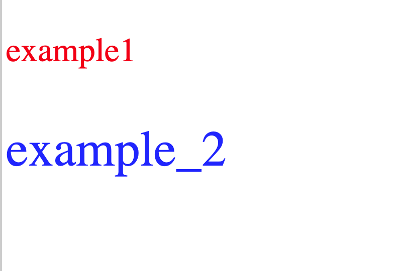

## はじめに

前回のVue入門①ではVueの基本的な書き方についてまとめていきました。

https://terrblog.com/entry/2020/01/27/013611

今回からはVueのテンプレート構文に入ります

テンプレート構文はVue独自の書き方で、Vue学習の基本に当たる部分になります。

## v-bindとは？

v-bindはタグの属性の値に変数などを設定できます。  
設定する値には変数やオブジェクトなどを入れることができます。

  
宣言方法は

```
v-bind: 属性名 = ‘設定する値’
```

## 例題！v-bindでスタイルを変えよう！

例題：v-bind使って文字の色とフォントサイズが違うexample1とexample2を出力する。  
各文字の色とフォントサイズは以下に示す。

example1：文字色=red、フォントサイズ=20pt  
example2：文字色=blue、フォントサイズ=30pt

やる気のある人は一緒に考えてみましょう！！

## 解説

<出力結果>



<使用コード>

```
<!DOCTYPE html>
<html>
  <head>
    <title>例題</title>
    <script src="https://unpkg.com/vue"></script>
  </head>

  <body>
    <div id="app">
      <p v-bind:style="styles">{{message}}</p>
      <p v-bind:style="styles_2">{{message_2}}</p>
    </div>

    <script>
      var data = {
        message: "example1",
        message_2: "example_2",
        styles: {
          fontSize: "20pt",
          color: "red"
        },
        styles_2: {
          fontSize: "30pt",
          color: "blue"
        }
      };

      var app = new Vue({
        el: "#app",
        data: data
      });
    </script>
  </body>
</html>
```

v-bindに該当する所の詳細を見ていきます。

### 表示(出力)の部分

```
<div id="app">   
   <p v-bind:style="styles">{{message}}</p>    
   <p v-bind:style="styles_2">{{message_2}}</p>
 </div>
```

今回は文字色とフォントサイズを変更するので、v-bindを使ってstyle属性を指定しています。  
styleの値は上はstyles、下にはstyles\_2を置いています。

### スクリプト

```
 var data = {
        message: "example1",
        message_2: "example_2",
        styles: {
          fontSize: "20pt",
          color: "red"
        },
        styles_2: {
          fontSize: "30pt",
          color: "blue"
        }
      };
```

data変数にはオブジェクトを入れています。  
v-bindで指定したstylesとstyles\_2に値を置いてスタイルを変更しています。

stylesにはフォントサイズ20pt、カラーをredに。  
styles\_2にはフォントサイズ30pt、カラーをblueを置く事で、画像の様な出力結果になります。

## まとめ

テンプレート構文の1歩目としてv-bindについてまとめていきました。  
今回はv-bindにてスタイルを変更する例を行いましたが、他にクラスなどもよく使われます。
