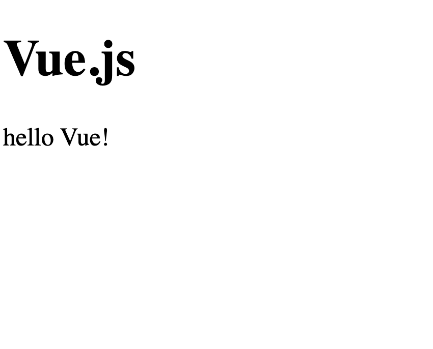

## はじめに

本記事はVueの初心者を対象に、Vueでどうやって「Hello Vue!!」が出力されているかについて記しました。  
  
また、掌田津耶乃氏の「Vue.js&Nuxt.js　超入門」を参考にしています。

本記事を読んでVueについて深く知りたくなったら是非、手に取って下さい。

## Vueの基本的な型

Vue.jsは大きく分けて**「出力の部分」**と**「スクリプト」**の2か所から成り立っています。

これを「Hello Vue!!」を出力する方法例に見ていきましょう。



ソースコードは以下の通りです。

```markup
<!DOCTYPE html>
<html>
    <head>
        <title>My first Vue app</title>
        <script src="https://unpkg.com/vue"></script>
    </head>
 
    <body>
        <h1>Vue.js</h1>
        <div id="app">
             {{ message}} <!--この中にはJsの式もかける -->
        </div>
 
        <script>
            // 連想配列(オブジェクト)
            var data = {
                message: 'hello Vue!'
            }
        
            //インスタンス化
            var app = new Vue({
                el: '#app',
                data: data,
            })
 
        </script>
    </body>
 
</html>
```

## 解説

### 表示(出力)の部分

```
      <div id="app">
             {{ message}} <!--この中にはJsの式もかける -->
        </div>
```

上のコードのポイントは2つです。

・\[id="app"\]とcssセレクタを宣言している点。  
・{{message}}で変数のmessageに値を入れている点。ちなみにこの構文をムスタシェ構文という。（らしい笑）

### スクリプト

```
<script>
            // 連想配列(オブジェクト)
            var data = {
                message: 'hello Vue!'
            }
        
            //インスタンス化
            var app = new Vue({
                el: '#app',
                data: data,
            })
 
  </script>
```

3行目～5行目：var data ={‥省略‥}：dataという変数にオブジェクトを作っています。

8行目～11行目：var app = new Vue({‥})：Vueオブジェクトのインスタンスを作成しています。

#### Vueのインスタンス作成

```
var 変数 = new Vue({オブジェクト})
```

オブジェクトの中身は以下の形で宣言する。

```
{el:対象,
data:値(オブジェクト)}
```

対象：\[タグにつけたセレクタ］  
値：オブジェクトを配置

3行目～5行目での変数をdataプロパティの値にいれる。このdataプロパティの値をelプロパティで宣言した対象内の変数として使うことができる。

## まとめ

今回はVueにて「Hello vue!」を出力する方法について簡単にまとめていきました。  
  
次回はtemplate構文について記していきます。
