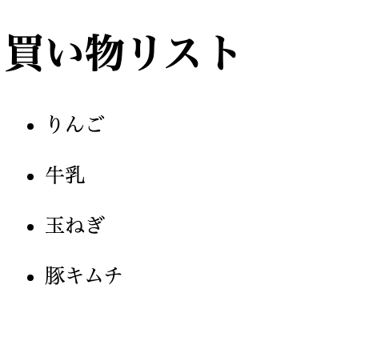

## はじめに

今回はvueのテンプレート構文であるv-forの基本的な使い方を解説し、v-forとv-ifを組み合わせて下記の様な仕組みを作っていきます。  
  
v-ifに関しては過去の記事にて解説しているので、そちらを参考にして下さい。

https://terrblog.com/entry/2020/01/29/002138

## v-forの使い方

繰り返し表現であるfor文に相当するテンプレート構文です。  
構文は以下の様に書きます。

```
<タグ v-for="変数 in 配列">
  {{変数}}
</タグ>

※配列：[.......],
```

配列の中身が変数に格納されます。  
この配列にはオブジェクトも入れることができ、オブジェクトを入れた場合は以下のようになります。

```
<タグ v-for="(item,key) in オブジェクト">
  {{変数}}
</タグ>

※配列：[.......],
```

itemに値、keyにプロパティが格納されます。

### 買い物リストを出力する



まず、上記の様な買い物リストを使って、v-forの基本的な使い方を見ていきましょう。

```
<h1>買い物リスト</h1>
    <div id="app">
      <ul v-for="item in items">
        <li>{{item}}</li>
      </ul>
    </div>

    <script>
      var data = {
        items: ["りんご", "牛乳", "玉ねぎ", "豚キムチ"]
      };

      var app = new Vue({
        el: "#app",
        data: data
      });
    </script>
```

var dataにて買い物リストの内容をitems配列に設定します。  
v-forを使ってそれをitemに格納し、リスト表示させればOKです。

## リストを条件に応じて表示する

さて、v-forとv-ifを使ってクリックするとリストが表示される仕組みを作っていきましょう。

要件  
・リストバー(柱、上弦)をクリックするとリストの中身(キャラクター名)が表示される。  
・再度リストバーをクリックするとリストの中身が閉じる。  
・v-forとv-ifを使う。

### サンプルコード

```
<!DOCTYPE html>
<html>
    <head>
        <title>例題3</title>
        <meta http-equiv="content-type" charset="utf-8">
        <script src="https://unpkg.com/vue"></script>
    </head>
 
    <body>
        <h1>鬼滅の刃のキャラクター紹介(柱、上弦の鬼)</h1>
 
        <div id="app">
            <table id="table1">
                <tr>
                    <th><button onclick="doAction();">柱</button></th>   
                </tr>
                <template v-if="ha">
                    <tr v-for="item in hasira">
                        <td>{{item}}</td>
                    </tr>
                </template>
 
            </table>
        </div>
        <div id="app_2">
            <table id="table2">
                <tr>
                    <th><button onclick="doAction_2();">上限</button></th>
                </tr>
                <template v-if="zyo">
                    <tr v-for="item_2 in zyougen">
                        <td>{{item_2}}</td>
                    </tr>
                </template>
            </table>
          </div>
 
          <script>
              var data = {
                  hasira:['煉獄 杏寿郎','宇随 天元','甘露寺 蜜璃','悲鳴嶼 行冥','時透 無一郎','伊黒 小芭内','冨岡 義勇','胡蝶 しのぶ','不死川 実弥'],
                  zyougen:['堕姫/妓夫太郎','玉壺','半天狗','猗窩座','童磨','黒死牟'],
                  ha:false,
                  zyo:false
              };
   
              var app = new Vue({
                  el:'#app',
                  data:data
              });
              var app = new Vue({
                  el:'#app_2',
                  data:data
              });
   
              function doAction(){
                  data.ha = !data.ha
              }
   
              function doAction_2(){
                  data.zyo = !data.zyo
              }
          </script>

　　　　　　<style>
            body{
                width:100% ;
                height: 500px;
            }
 
            h1{
              position: absolute;
                top:0px;
                left:0px;
                white-space: nowrap
            }
            #table1{
                position: absolute;
                top: 75px ;
                left:10px;
                display: inline-block;
                width: 300px;
                margin-right:0px;
            }
            #table2{
                position: absolute;
                top: 75px ;
                left:315px;
                display: inline-block;
                width: 300px;
                margin:0px;
             }
            body{
                display: inline-block;
                width: 300px;
                margin-right:0px;
            }
 
            tr{
                display: inline-block;
                width: 300px;
                
            }
 
            table tr th{
                display: inline-block;
                width: 300px;
                font-size: 16pt;
                color: white;
                background-color: gray;
            }
            table tr td{
                display: inline-block; 
                width: 300px;
                font-size: 16pt;
                color: gray;
            }
            button{
                width: 300px;
                background-color: gray;
                border: 1px solid gray;
                outline: 0;
            }
        </style>
      </body>
  </html>
  
```

### html部分

```
 <h1>鬼滅の刃のキャラクター紹介(柱、上弦の鬼)</h1>
 
        <div id="app">
            <table id="table1">
                <tr>
                    <th><button onclick="doAction();">柱</button></th>   
                </tr>
                <template v-if="ha">
                    <tr v-for="item in hasira">
                        <td>{{item}}</td>
                    </tr>
                </template>
 
            </table>
        </div>
        <div id="app_2">
            <table id="table2">
                <tr>
                    <th><button onclick="doAction_2();">上限</button></th>
                </tr>
                <template v-if="zyo">
                    <tr v-for="item_2 in zyougen">
                        <td>{{item_2}}</td>
                    </tr>
                </template>
            </table>
          </div>
```

6行目  
・buttonタグにonclick(クリックした際の反応)でdoAction関数をセットしいます。

8行目  
・v-ifを使って条件分岐をしています。(今回は変数haのtrue or falseで判定)

9行目  
・v-forを使用して配列である「hasira」の値をitem変数に格納しています。

10行目：上記のitem変数をリスト表示しています。

16行目以降は同じ事の繰り返し。

### スクリプト部分

```
 <script>
              var data = {
                  hasira:['煉獄 杏寿郎','宇随 天元','甘露寺 蜜璃','悲鳴嶼 行冥','時透 無一郎','伊黒 小芭内','冨岡 義勇','胡蝶 しのぶ','不死川 実弥'],
                  zyougen:['堕姫/妓夫太郎','玉壺','半天狗','猗窩座','童磨','黒死牟'],
                  ha:false,
                  zyo:false
              };
   
              var app = new Vue({
                  el:'#app',
                  data:data
              });
              var app = new Vue({
                  el:'#app_2',
                  data:data
              });
   
              function doAction(){
                  data.ha = !data.ha
              }
   
              function doAction_2(){
                  data.zyo = !data.zyo
              }
          </script>
```

2行目~  
・data変数にオブジェクトを格納しています。オブジェクトの中身は2種類で。  
・hasira/zyougenプロパティで値に配列を設定。  
・ha/zyoプロパティにブーリアン型(true/false)を設定。

9行目~,12行目~  
・各テーブルに対応するインスタンスを生成してる。インスタンスの内では以下を入れています。  
・Vueの対象のタグ(app、app\_2)  
・タグ内で使うオブジェクトをプロパティとして持たせています。

18行目~、22行目~  
buttonタグをクリックした時の関数、doActionを定義しています。  
ここでは、dataオブジェクトのha/zyoプロパティの値(ブーリアン型)を反転させています。  

  
  
  
  
理解できましたか？？  
今回の内容でv-forとv-ifを組み合わせて使う事にも慣れてきたかと思います。

このブログではフロントエンドの知識を分かりやすく解説して行きます。  
是非フォローお願いします。  
[https://twitter.com/teriteriteriri](https://twitter.com/teriteriteriri)
