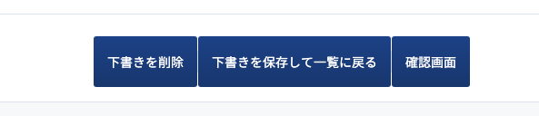

# はじめに

Laravelのbladeでhtmlのコーディングを行っていると、「Vueのコンポーネントの様に中身だけ変えて使い回したい！って場面が多々出てくると思います。

そんな時にLaravelに元々あったsectionとは別にslotという機能がめちゃくちゃ感覚的に使えて良かったので説明していきます。

# slot機能とは

まず、プロダクトの中で使い回すパーツをコンポーネントと呼びます。  
例えば、こんな感じのボタンですかね。


これをslot機能を使う事で、中の文言だけ変えて色々なところで使い回していきます。

# slotの使い方

## コンポーネント作成

まずコンポーネントを作っていきます。

変えていきたい部分を `{{$slot}}` としておきます。

```
<button class="Button -fill -blue" type="button">
    <span class="Button__inner">
        <span class="Button__text">
            {{$slot}}
        </span>
    </span>
</button>
```

ちなみにボタンのscssはこんな感じですでに定義しています。

```
.Button {
    @at-root {
        & {
            display: inline-flex;
            border: 0;
            border-radius: 3px;
            background-color:#ffffff;
            color: black;
            font-size: 14px;
            text-decoration: none;
            vertical-align: middle;

            &:hover {
                opacity: 0.8;
            }

            &.-fill {
                background: linear-gradient(to bottom, #fefefe 0%, #f3f5f7 100%);

                &.-blue {
                    background: linear-gradient(180deg, #1E4A91 0%, #193E79 100%);
                    color: $white;
                }

                &.-red {
                    background: linear-gradient(180deg, #F85359 0%, #DC151D 100%);
                    color: $white;
                }
            }

        .Button__inner {
            display: flex;
            align-items: center;
            justify-content: center;
            width: 100%;
            min-height: 32px;
            padding: 4px 15px;
            border: 1px solid $border-color;
            border-radius: 3px;
        }

        .Button__text {
            flex: 0 1 auto;
        }
    }
}
```

これにてボタンのコンポーネントはできました。

## コンポーネントを呼び出す

先ほど作ったコンポーネントを呼び出していきます。

```
@component('button')
    確認画面
@endcomponent
```

この様に`('button')`の部分にコンポーネント名。  
`@component`と`@endconponent`の間に`{{$slot}}`に入れたい文言を書きます。

# ボタンを使い回す！

今後ボタンを使うときは、先ほどやった様に文言を指定して呼び出してあげるだけで簡単にできます。  
`top.blade.php`のみをいじる事で様々な文言のボタンを出してみましょう。



```
<div class="Button_group">
  @component('button')
    下書きを削除
  @endcomponent
  @component('button')
    下書きの保存して一覧の戻る
  @endcomponent
  @component('button')
    確認画面
  @endcomponent
</div>

<style>
.Button_group{
display:flex;
}
</style>
```

こんな感じで簡単に文言違いのボタンを複製できますね。  
slotを使う事で、`@include`だけでは実践できなかった、ちょっとした変更ができる様になります。
