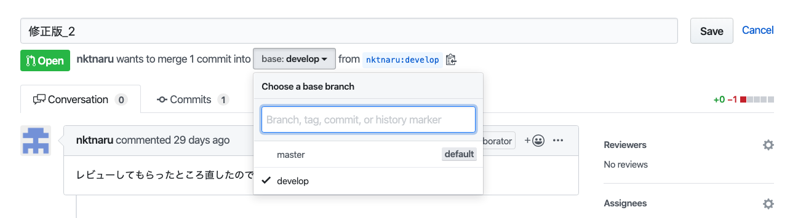

## 補足

qiitaの方にも同じ記事を挙げています。有益なコメントや修正依頼をqiitaのみで受けていた為、記事としてはqiitaの方が最新になっています。

https://qiita.com/terry\_6518/items/44ce2419a78d4121569a

# はじめに

Gitって難しいですよね。本当に！

プログラミング歴1年弱の自分がチーム開発に加わる様になってに一番不安なのはGitの扱いです。  
ミスにビクビクしながら、日々を過ごしています。

**そんな僕が初学者達が現場でうま〜く立ち回れる様に、Gitに慣れていない人がよくハマるパターンと対処法をまとめました。**参考になれば幸いです。

# 作業ブランチ間違えて作業しちゃった！！パターン

これは僕が一番やっちゃうやつです！  
作業している途中や、`git status`している辺りでブランチを間違えていた事に気がつきます！

## 対処法

```
1 git stash -u  
 一旦、作業していた分を退避する

2 git checkout 正しいブランチ名
　正しいブランチに切り替える

3 git stash pop 
 退避していた分を正しいブランチの方に持ってくる
```

作業中に他の作業が差し込みで入った時なども、git stashで一旦退避させる事でブランチの切り替えが可能になります！

# commitメッセージを記入し忘れたー！パターン

これは`git commit`した後、ボーッとしててcommitメッセージを書き忘れたり、commitメッセージを書き間違えた時ですね。

## 対処法

これは簡単です！

```
git commit --amend 修正後のcommitメッセージ
```

# `git add .`でいらんファイルまでステージングしちゃったー！パターン

本当は`git add .`ではなく、`git status`→`git add ファイル名`で1ファイルずつステージングしていくべきなおですが、自分は一度にcommitするファイルが多い為、`git add .`を好んで使います。

そうすると、なぜかステージング済にpackage.json君などの変更しちゃいけない子が行ってしまう時があります。そんな時の対処法はこちらです。

## 対処法

```
#　ファイル名を指定して戻したい時
git reset ファイル名

#git addした全てのファイルを戻したい時
git reset .
```

# いらない追跡対象外のファイルがなぜかたくさんあって、このままだとcommitできねえー！！パターン

多分、pathの設定ミスによって起きるんだと思いますが、、  
追跡対象外のファイルが大量に変更済エリアに雪崩れ込んでくることがあります。

そんな時の一時的な対処法です。

## 対処法

```
# カウントディレクトリ内の追跡対象外のファイルを確認する
git clean -n
# カウントディレクトリ内の追跡対象外のファイルを削除
git clean -f
```

これで邪魔なファイル達は消えてくれるので、commitが進められます。

# プルリクを送る先を間違えたーー！パターン

これは正確にはGitじゃなくて、Githubでのミスなのですがご愛嬌。  
Githubからプルリクエストを送る時に`develop`に送りたいのに間違えて`master`に送っちゃったー！レビュアーの人に見られる！！的な場合の対処法ですね。

## 対処法




1 Githubで対象のプルリク のページに行きます。  
2 下記の画像の右上の`Edit`の所をクリックして完了です！  
  
3 下記の画像の様に、送り先のブランチを切り替えて、右上のSaveを押します。  

# プルリクエストのLGTMぐらいカッコ良く出してええ！！パターン

これまた正確にはGitではありませんが、プルリクのレビュアーをする際にただテキストでOKやLGTMを出すだけでは味気ないですよね。  
あまり開発で貢献できない分、コミュニケーションでチームを盛り上げて行きたい！そんな時の対処法はこちらです。

## 対処法

LGTMの画像を作って送りましょう。  
https://lgtm.fun/

プルリクを出した人が乃木坂のファンならこちらを送り


最近鬼滅の刃を見た様ならこちらを送りましょう！


# まとめ

とはいえ、今回書いたハマるパターンといっても**うっかりミスがほとんどです！普段から確認を怠らない姿勢でGitを扱う事が一番の対処法だと思います。**
