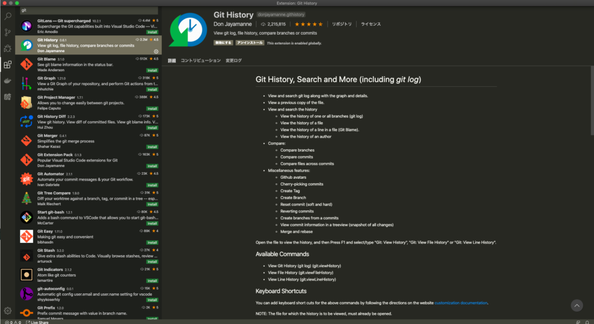
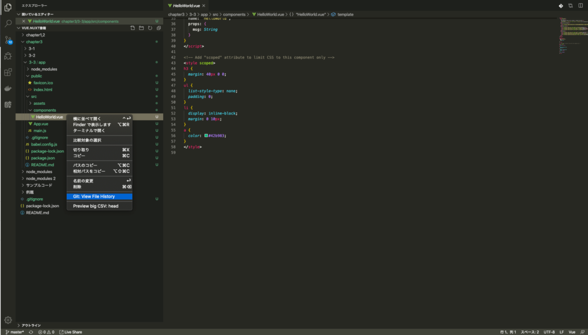
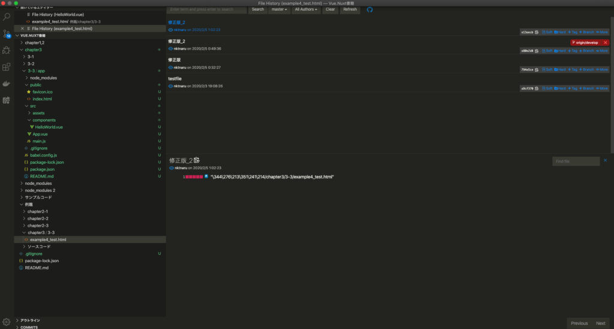

## git histryはvscodeの拡張機能

git histryはcommit単位で差分を見る事ができるvscodeの中でも外せない拡張機能です。

これを使えば  
・以前のcommit後の状態にファイル毎に飛ぶ！  
・それぞれのcommit間での差分を確認する！  
などが出来ます。

gitでの変更履歴の確認には欠かせないツールですね。

## git historyをvscodeに導入する！

1 vscodeの拡張機能で「git history」で検索する。  
2 インストールしてvscode内で有効化する。

## git historyの使い方

### 1 vscode上で変更履歴を見たいファイルを右クリック→「Git:View File History」をクリック。

### 2 変更履歴を確認したいcommitを選ぶ

この画像では一番上の修正版\_2を選んでますね。  
上のタブの部分を使えばブランチ、作成者での絞り込みもできます。

### 3　ファイルを選択してcommit差分を見る

こんな感じでcommit一覧の中から差分を見たいcommitを見つけます。  
今回は「コミット修正」を選んでますね。

次に、選んだcommitの中で変更履歴を確認したいファイルを選んで、「compeir ~~ workspace」でワークスペースとの差分を確認しています。

この様に「commit→file→workspaceかcommit前との差分か」の流れで変更履歴を見ていけます。

## まとめ

今回はgit historyでの変更履歴の確認方法についてまとめていきました。  
慣れないうちはgitでの作業は常にハラハラするし、失敗もつきものだと思います。  
こちらにてあるあるミスについてもまとめたので、興味あれば参考にしてください。

https://terrblog.com/entry/2020/03/05/232836
