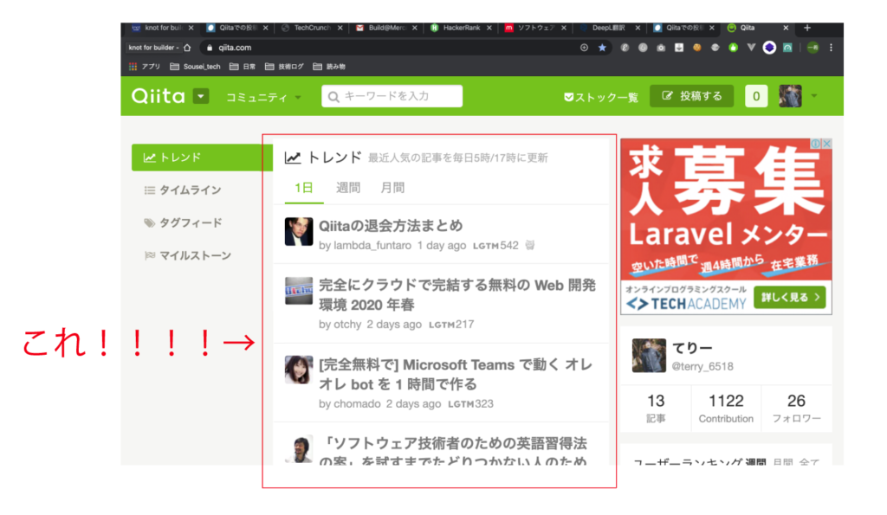

最近、qiitaでの投稿でLGTM(いいね)が良く付く様になったので、それに関して考察します。

## 背景

今回Qiitaでの投稿がバズっている思った経緯としては、1ヶ月前に初めてqiitaでの投稿がデイリートレンド入りをしてから、3記事連続でデイリー/ウィークリートレンド入りを果たし、週間のユーザーランキングにも乗る様になったからです。

マイページ：[https://qiita.com/terry\_6518](https://qiita.com/terry_6518)

一時的な波に乗っているだけの可能性もありあすが、体感としては今後も高い確率で「LGTM100越えの記事」は書けそうだなーと思っています。

## 記事はどの様にバズるのか

qiitaに書いた記事がどの様にバズって行ったの流れをまとめていきます。  
LGTM1000を超える様な記事は流れそのものが違うかもしれません！

### 1\. 12~24時間の間にLGTMが最低10個ほど付く

いきなりですが、ここがバズるかどうか1番の難所です！

こちらの記事によると、LGTMの分布は偏っていてLGTM10を超える記事は全体の上位20%に当たっています。

[https://qiita.com/mtitg/items/25e3d0d75429dcfeb199#%E3%81%84%E3%81%84%E3%81%AD%E6%95%B0%E3%81%AE%E5%88%86%E5%B8%83](https://qiita.com/mtitg/items/25e3d0d75429dcfeb199#%E3%81%84%E3%81%84%E3%81%AD%E6%95%B0%E3%81%AE%E5%88%86%E5%B8%83)

qiitaでのフォロワーやtwitterでのフォロワーなどが増えてくると、記事を書いた時の最初の露出を増やせるので、LGTMが短期間で10を超える可能性がグッと上がります。

qiitaの結果にだけコミットすると最初は「技術的に良い記事」よりも「身近な人の参考になる記事」をピンポイントで書いた方が得策だと思います。

### 2\. デイリーのLGTM数集計記事に載る

ちょうどLGTMが10を超えた辺りから、デイリーでのLGTM数の集計記事に載れます。

こういうのですね。

https://qiita.com/okadato623/items/50b96ed7b7bbe8ff35e8

これにより最低限の露出を担保することができます！！逆にいうとここでデイリーのLGTM集計記事に載らなかったら漏れなくそこで終わります！(てりー調べ)

### 3\. デイリートレンドに載る

集計記事に載った後に順調にいけば、今度はデイリートレンドという1番目立つ所に載ります。

これによって爆発的にView数が伸びていきます。通知が止まらないー!みたいな現象も起きます。

デイリートレンドは毎日5/17時での集計なので、デイリーLGTM数集計記事に載ってから半日後にデイリートレンドに載れているぐらいが目安になります。

デイリートレンドは20位ぐらいまでありますが、最初は下の方でも載れればOKです。

僕個人の今までの記事のデイリートレンドでの推移として

仮想DOM記事：18-8-2-2(位)  
Git記事:16-6-3-2(位)→ウィークリー18位  
HTML手順記事:10-6-4-2(位)→ウィークリー13位

でして、デイリートレンドには4回の掲載がマックスなのかなーといった印象です。半日おきの更新なので投稿から1~3日後にトレンド入りを果たしているイメージです。

### 3\. 100LGTM毎に公式が取り上げてくれるかも

これは完全なる運なのですが、LGTMが100の倍数でキリが良いとqiita公式が取り上げてくれたりします。

https://twitter.com/Qiita/status/1235822426631467010?s=20

https://twitter.com/Qiita/status/1238298807001059328?s=20

qiita公式アカウントは3万人近くフォロワーがいて、とても拡散効果を期待できるので、取り上げてもらえたらバズるスピードがブーストします。

大まかな流れでトレンド等の露出が続いている間は一定のペースでLGTMが増えていき、露出が止まると収束していきます。

## 最初のLGTM10個を貰う為に工夫している事

LGTMが良くついている記事とそうじゃない記事を比較しても「LGTM数/View数」の割合はそこまで大きな開きはありません。

僕の場合、LGTMの数が0出ない記事ならだいたい3~5%に落ち着きます。  
なので、LGTMが多い記事は漏れなくView数が多い記事だという事になります。

qiitaではLGTMなど一定の評価を受け始めた記事が、さらに露出を増やせる仕組みは多く用意されているのですが、LGTMが10個以下の記事が全体の8割を占める様に0→1のフェイズは個人に委ねています。

そこで我々がバズる為に個人で行わなければいけないのが、**「qiita内での露出は少ないけど、他の方法でview数を稼ぐ事」**です。

### 初期のView数を稼ぐ為にやっている事

以下は自分が意図的に「**qiita内での露出は少ないけど、view数を稼ぐ**」為に行っている事です。

・twitterの自分のフォロワーの属性に合わせた記事を書く  
　→自分の場合、「初心者・Vue・実務未経験」辺りが多い

・その記事を書くにあたって、きっかけやインプット面で協力してくれた人達に報告する  
　→自分の場合、記事にした技術について教えてくれた先輩や勉強会などのコミュニティなどにお礼やニュアンスが伝わるかも兼ねて報告している

・タイトル、タグを工夫する  
　→ありきたりな事ですが重要なので。自分はこの記事を参考にしています。  
成功体験を繰り返し感覚的に捉えられるのが1番良いですが、最初は見様見真似でやってみると良いかと思います。  
タグに関しては、5つまで設定できて該当のコミュニティーのニュースフィードに流れます。記事の内容に沿ってタグを選ぶ事は当たり前ですが、その上で5つ全てを使い切る事、より人数が多く活発なコミュニティーのタグを選択する事、辺りは意識しています。

https://qiita.com/Ancient\_Scapes/items/bba0fab1e55936e7234a

## まとめ

今回はqiitaの記事について考察していきました。  
qiitaには現在で13記事投稿していますが、LGTMが100を超えたのは最近の3記事だけで、後の記事はLGTM 10以下となっています。

LGTMが10以下の記事には、多くの時間を費やした個人的力作なども含まれています

google検索からたどり着いた記事がめちゃくちゃ優秀だったのに、LGTM数は少ない！といった出来事も何回か目にしています。

LGTMは記事の質の尺度ではありませんが、多くの人に届けたい内容の記事ならば、今回書いた内容も少し参考になるかもしれません。
