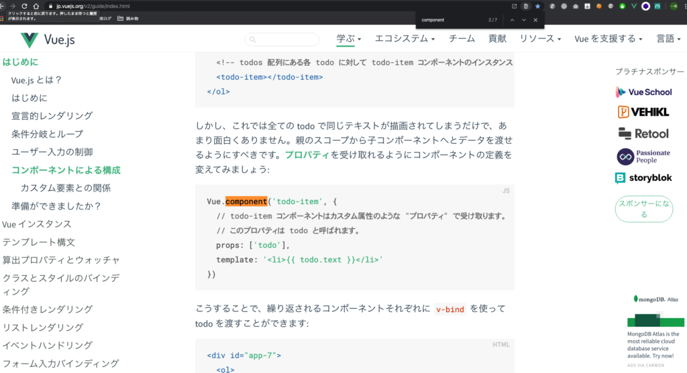
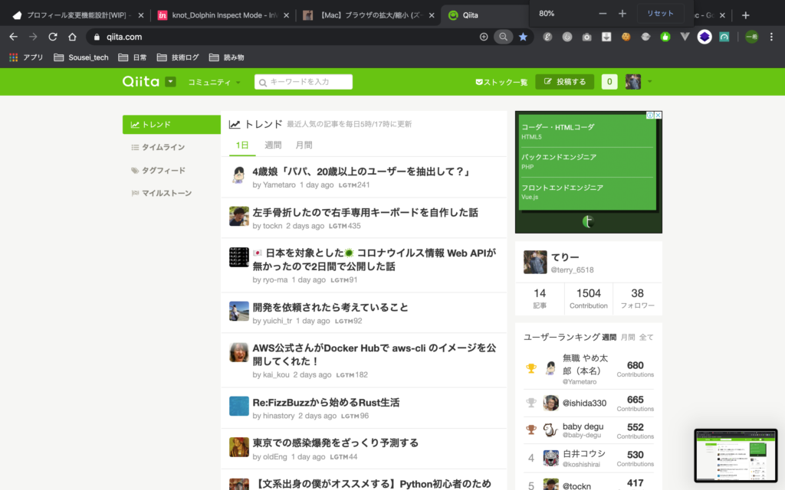

普段の開発の時によく使う小技をチートシートの様にまとめました！(WIP笑)  
macの場合に限りますが、自分メモも兼ねてどんどん足していきます。

## ページ内検索

ドキュメントを読んでる時に、この用語でgrepしたいって時などに使えます

google chromeの場合です。

### **⌘(command) + F**

こんな感じでページの右上に検索バーの様な物が出てきて便利です。

## デスクトップ切り替え

これは必須レベルの技術。  
macbook proだとツールバーの部分でデスクトップを切り替えられるらしいが、僕にはそんなもの手元にないので自力で切り替えます！！

slack開きながら、デザインを確認して、IDEデコーディンしつつ、ブラウザで確認！ってそれだけでサブディスプレイ持っていたとしてもディスプレイの切り替えのタイミングは頻繁にありますよね。

### 3本指でスワイプ！

3本の指でトラックパッドを横にスワイプしてみてください！  
革命的なぐらい簡単に切り替わりますよ。

## 画面スクロール

画面をスクロールするやつ。エンジニア向けのqiitaとかドキュメントって基本的に長いので、ヌルヌルスクロール出来た方が良いです。

### 2本指で上下にスクロール

ヌルヌル動かせて感動します。  
左横にスワイプしちゃうとブラウザバックになっちゃうので注意して下さい！！

## 拡大・縮小

拡大縮小です。デザインデータなどを見ている時は常に縮小して全体像、拡大して部分部分を見たかったりするので、コマンドだけでいじれると助かります。

ちなみにトラックパッドで2本指でも出来るのですが、割と指の動きの難易度が高く反応しない為、ショートカットを僕は多用しています。

### **⌘(command) +** ーで縮小！**⌘(command) +** shift+➕で拡大！

拡大か縮小を押すとウィンドウの右上に大きさのバーが出てきます。(現在は80%ですね)  
これで今の表示の割合もわかるし、リセットを押せばデフォルトで設定している大きさに戻ります。

