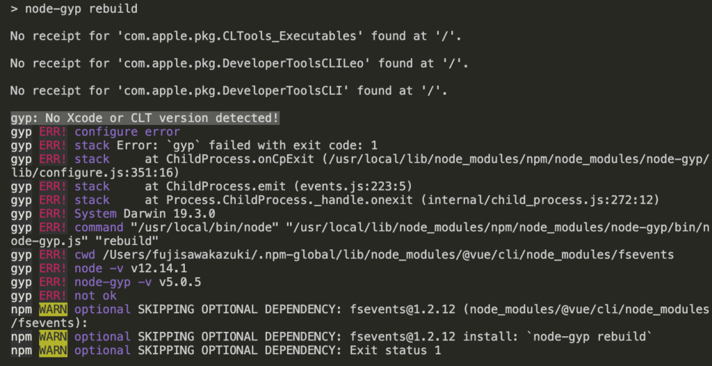

## 要約

・vue-cliでローカルにvue環境を作ろうとした  
・`npm install -g @vue/cli`で「`gyp: No Xcode or CLT version detected!`」というエラーが出た  
・xcodeの再インストールで解決した

## Vue-cliでローカルにvue環境を作ろうとする

以前のqiitaにも書きましたが、チームとしてコーディング規約が無い！という事で現状もあって、コーディング規約を作る事になりました。

https://qiita.com/terry\_6518/items/274d9e231063114bc703

手元で試せる環境が必要になり下記の記事を見てvue-cliをインストールしていきます。

https://qiita.com/kamitomo/items/34451b11caaf51bd2498

しかし、`npm install -g @vue/cli`を叩いた時点でエラーの嵐が、、、

すんなりいくと思っていたvue-cliのインストールですが、そう簡単にはいかない様です。

## エラーコード「gyp: No Xcode or CLT version detected!」の原因を探る

どうもエラーコード を読むとxcodeが悪さをしている様です。  
とりあえず「gyp: No Xcode or CLT version detected!」でググってみると、こんな記事が。。

https://kimulog.com/2020/02/11/npm-install-fails-when-node-gyp-rebuild/

内容的にはxcodeを再インストールする事で、解決しました。  
正しくnpmがインストールされれば、vue-cliの環境も簡単に作ることができます。

## まとめ

vue-cliのインストールでつまずいた部分を備忘録としてまとめました。  
以前にも似た様な内容で転んだことがあるので、教務ある人はこちらも参考にしてください。

https://qiita.com/terry\_6518/items/6a91da800389536feb92
