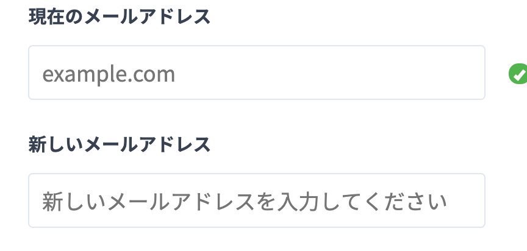
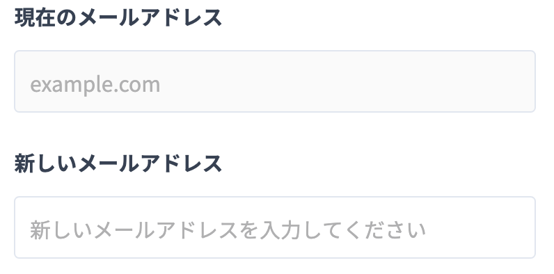

自分用の備忘録。

フォームでよく使われるInputタグのplaceholderやdisabledの時に装飾方法です。

特に装飾していない状態だとInputタグは以下の様になります。



「現在のメールアドレス」は入力できない様にdisabledを施していますが、色が一緒な為、気が付きにくいです。

また「新しいメールアドレス」はplaceholderの文字が大きすぎる為、窮屈だし、文字色も薄めにしたいです。

以下の画像の様な状態を目指します。



## やり方

scssのみ記入します。

```
 .Input {

      &:disabled {
        background-color: #fafafa;
      }

      &::placeholder {
        color: #b0b0b1;
        font-size: 12px;
        letter-spacing: 0;
        line-height: 18px;
      }
    }
```

この様に擬似要素とすると、Inputタグ内のdisabledやplaceholderにcssが当たります。

以上。
