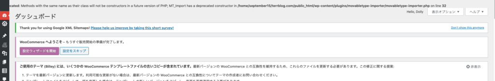

## デバッグモードとは

デバッグモードをオンにする事で、警告やエラー文を吐き出してくれます。 phpでいうvar\_dumpやJavaScriptでいうconsole.log()の様な役割ですね！ 実際にwordpressに支障が出ている時の開発には必須になってきます。

## デバッグモードの使い方

wp-config.phpを編集します。 サーバーから弄っても良いですし、手元に落としてきて編集しても良いです。

コードとしては下記の部分を見ます。

開発者へ: WordPress デバッグモード \* \* この値を true にすると、開発中に注意 (notice) を表示します。 \* テーマおよびプラグインの開発者には、その開発環境においてこの WP\_DEBUG を使用することを強く推奨します。 \* \* その他のデバッグに利用できる定数については Codex をご覧ください。 \* \* @link http://wpdocs.osdn.jp/WordPress%E3%81%A7%E3%81%AE%E3%83%87%E3%83%90%E3%83%83%E3%82%B0 \*/ define( 'WP\_DEBUG', false );

こちらで最後のdefine( 'WP\_DEBUG', false );の部分のfalseをtrueに変えます。 すると開発画面にてエラー分が以下の様に吐き出されます。

エラー分さえ出てしまえば、ググるなり和訳するなりしてデバッグしていけそうですね。 今回は小ネタになりましたが、wordpressを使って開発している人にはぜひ普段から使ってみてください！！
