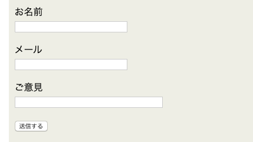
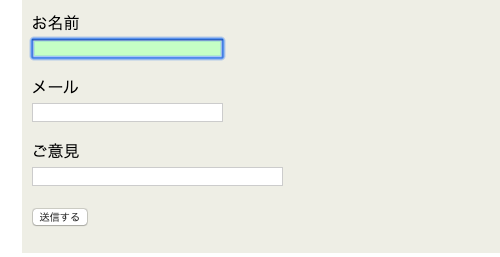

## はじめに

**:focus擬似クラス**。  
input:focus{ .....}みたいな使われ方をしていますね。

今日は**:focus擬似クラス**について簡単に解説していきます。

## **:focus擬似クラス**とは

そのクラスにユーザーがフォーカスした際のスタイルを指定できます。  
フォームなどのインプットタグなどで、入力時だけ背景が変わる場合などが**:focus擬似クラス**の恩恵を受けている例です。

## 使用例：入力フォーム



こんな感じのよくある入力フォームですね。  
ここで、入力を始めた時に、その要素の色が変わる様にしていきましょう。



### サンプルコード

github:[https://github.com/gunners6518/blog/tree/master/focus](https://github.com/gunners6518/blog/tree/master/focus)

```
<html>
<head>
<link rel="stylesheet" type="text/css" href="sample.css">
</head>
<body>
<form action="cgi-bin/abc.cgi" method="post">
<p>お名前<br><input type="text" name="namae" size="30"></p>
<p>メール<br><input type="text" name="mail" size="30"></p>
<p>ご意見<br><input type="text" name="goiken" size="40"></p>
<p><input type="submit" value="送信する"></p>
</form>
</body>
</html>

//フォーカス時の背景を変更
<style>
input:focus {background-color:#ccffcc;}
</style>
```
