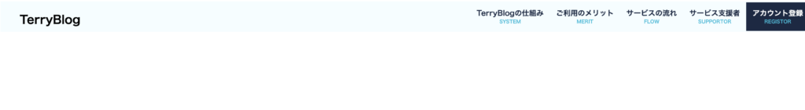
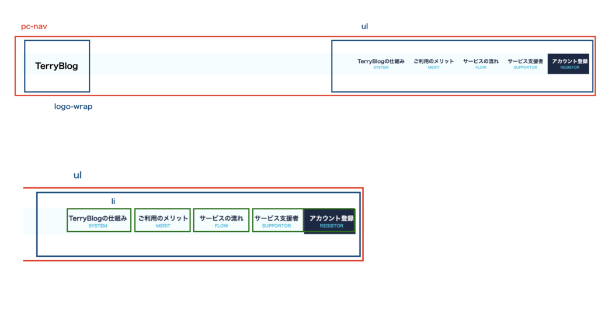

## はじめに

ちょうど最近やっているLPで、下記の様なヘッダーナブを作っていました。  
右側の部分をクリックすると、該当の部分までスクロールする系のナブですね。



動きは、右のメニューにホバー時(マウスが当たった時)に下線が真ん中からヌルッと出てくるパターンです。

## 実装パート

実装の手順を見ていきます。  
ソースコードはGitHubのリンクを貼るので、そちらで確認できます。

### レイアウトを書き出す

実際にHTMLをコーディングする前に、全体的なレイアウトを把握してあると良いです。

今回ですとこんな感じですね。



レイアウトの組み方が分からない人はこちらの記事に詳しく書いてあるので参考にして下さい。

https://qiita.com/terry\_6518/items/3c5862705cf9ff982f7a

### HTMLを積む

HTMLはシンプルですね。  
レイアウトでくんだ入れ子構造をそのまま反映させてあげます。

```
<nav id="pc-nav" class="pc-nav">
    <div class="logo-wrap">
        <h1 class="header-logo">TerryBlog</h1>
    </div>

    <ul>
        <li>
            <a href="#SYSTEM" >TerryBlogの仕組み<br><span class="sub-title">SYSTEM</span></a>
        </li>
        <li>
            <a href="#MERIT">ご利用のメリット<br><span class="sub-title">MERIT</span></a>
        </li>
        <li>
            <a href="#FLOW">サービスの流れ<br><span class="sub-title">FLOW</span></a>
        </li>
        <li>
            <a href="#SUPPORTOR">サービス支援者<br><span class="sub-title">SUPPORTOR</span></a>
        </li>
        <li>
            <a href="#REGISTOR" class="text-light -primary">アカウント登録<br><span class="sub-title">REGISTOR</span></a>
        </li>
    </ul>
</nav>
```

### cssを当てていく

まずは全体像です。

```
.pc-nav {
    width           : 100%;
    height          : 64px;
    display         : flex;
    justify-content : space-between;
    background-color: #F4FDFF;
    position        : fixed;
    z-index         : 6;
}

.pc-nav .logo-wrap {
    padding: 0 40px;
}

.pc-nav .logo-wrap h1 {
    font-weight: bold;
    font-size  : 24px;
    line-height: 36px;
}

.pc-nav ul {
    display    : flex;
    align-items: center;
    padding    : 0;
}

.pc-nav ul li {
    padding: 13px;
    display: inline-block;
}

.pc-nav ul li a {
    position       : relative;
    color          : #1A2944;
    line-height    : 20px;
    text-align     : center;
    font-size      : 15px;
    font-weight    : bold;
    transition     : all 0.5s;
    text-decoration: none;
    display        : inline-block;
}

.pc-nav ul li a::after {
    position        : absolute;
    bottom          : -4px;
    left            : 0;
    height          : 2px;
    content         : '';
    width           : 100%;
    background-color: #1A2944;
    transform       : scale(0, 1);
    transform-origin: center top;
    transition      : .3s;
}

.pc-nav ul li a.-primary{
    color: #FFFFFF;
}

.pc-nav ul li a.-primary::after {
    background-color: #FFFFFF;
}

.pc-nav ul li a:hover::after {
    transform: scale(1, 1);
}

.pc-nav ul li a .sub-title {
    font-size  : 10px;
    line-height: 14px;
    color      : #03BCDB;
}

.pc-nav ul li:last-child {
    background-color: #1A2944;
    color: #FFFFFF;
}
```

そこそこ量がありますね！  
ポイントになりそうな::afterや:hoverの部分を解説していきます。

#### a::after

```
//aの擬似要素にて下線を表現する。//
.pc-nav ul li a::after {

//下線の場所を以下のコードで指定。//  
    position        : absolute;
    bottom          : -4px;
    left            : 0;

//下線の高さを指定。//
    height          : 2px;
    content         : '';
    width           : 100%;
    background-color: #1A2944;

//下線の動きを指定。
transformではscale(0,1)としている為、通常時は動かなくなる。//
    transform       : scale(0, 1);

//真ん中なら広がっていくアニメーション//
    transform-origin: center top;

//動きの速度を指定。//
    transition      : .3s;
}
```

#### a:hover::after

```
//afterのhover時//
.pc-nav ul li a:hover::after {

//transformではscale(1,1)としている為、hover時は動き始める。//
    transform: scale(1, 1);
}
```

これにて実装完了！！

## まとめ

今回はあるあるなヘッダーナビのホバー時のアニメーションの実装について解説していきました。  
transform-originやtransitionを変える事で、広がり方や速度を様々に変更できるので皆さんも是非やって見て下さい。

github：[https://github.com/gunners6518/blog/tree/master/navbar](https://github.com/gunners6518/blog/tree/master/navbar)
