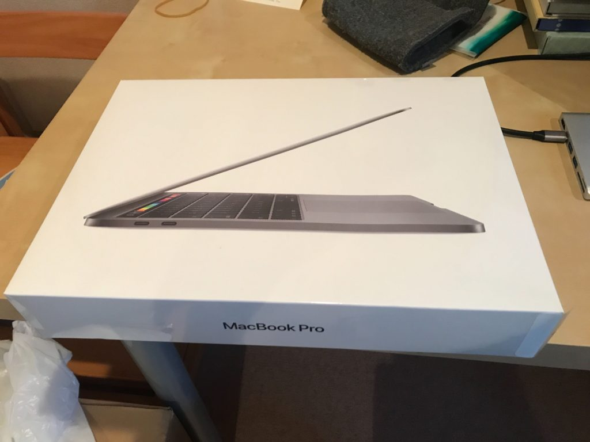

## はじめに

1ヶ月前にエンジニア歴1年を振り返って以下のような記事を書きました。

[https://terrblog.com/entry/2020/03/19/005431](https://terrblog.com/%e3%83%97%e3%83%ad%e3%82%b0%e3%83%a9%e3%83%9f%e3%83%b3%e3%82%b01%e5%b9%b4%e7%9b%ae%e3%82%92%e6%8c%af%e3%82%8a%e8%bf%94%e3%82%8b/)

振り返りをすると、自分にとって成果につながる行動がなんだったのか、客観的に見れてとても恩恵を受けられました。

コロナの影響などでフリーランスとしての立ち回りなども重要になってくると思うので、月単位で振り返りなどを行うべきだと思い。この4月の振り返りをしおうと思いました。

そんな背景で書いています。

## 振り返り

トピックややった事などを箇条書きでまとめていきます。

### 4月からエンジニアのシェアハウスに住み始めた

4月から新宿のシェアハウスに住みました。  
毎日、3人のエンジニアと共有リビングで作業しているので、作業の集中度合いや効率は上がっています。

日常的に案件や技術的な話が飛び交う環境はフリーランスで仕事をやっている身ではとても良いと感じています。

ただ仕事自体は3月からフルリモートで仕事を行なっていて、コロナの影響で外出もしていないので、新宿に住んでいるという地理的な恩恵は全く受けられていないです。

### macbook pro 13インチを買った

8メモリのmacbookでホットリロードが落ちていることに悩まされてきましたが、遂にmacbook pro 13インチを買いました！！

データの移行や環境構築等にまだ手間取っているので、日常的に100%使っているわけではありません。

それでもスペックの違いをひしひしと感じられて幸せです。  
プログラミングやり初めに比べて、環境構築やpathの設定などがスルスルできるようになっていて成長を感じました。

フルリモートへの移行で、ワークスペースへの投資は今後数ヶ月続きそうで、次はAirpods proやメインのモニターに手を出しそうです。

### Laravelのフォームリクエスト

Laravel5.8のフォームリクエストを使って、webアプリ全体でのバリデーションルールの設定やエラーメッセージのカスタマイズを行いました。

参考

[https://readouble.com/laravel/5.8/ja/validation.html](https://readouble.com/laravel/5.8/ja/validation.html)

その他、Uniqueバリデーションを使って、「同一テーブル内で重複したメールアドレスが登録されないよう！」なども出来るようになりました。実用的機能ですね！笑

### Laravelのフォーム系の機能やデザイン修正

先週ぐらいから新しい案件として、Laravelの機能追加の作業も行いました。  
お問い合わせからBCCで管理者にメールを送る機能やフォーム画面の修正などを行いました。

Laravelを触る機会も増えてきたので、MVCの構造やコードが割と読めるようになってきました。  
まだ不安な要素もありますが、サーバー側に知見も広げていけると、Vue.js×Laravelでサービスに寄与しやすいのかなーと思っています。

### Vue.jsで新機能のフロント部分を作成

Vue.jsを使って、新しい機能の画面を3ページ作成しました。  
といっても新しく作ったコンポーネントは5~6個ぐらいで、他は既存のを使いまわしながらでも対応できました。

技術的にも新しい学びというよりは、Vue.jsを使って問題なく動的なページが作成できるようになってきたという感じでした。

### LP制作でcss設計を学ぶ

4月の頭に1件、LPの案件を受けまして、4月一杯で終わりそうです。  
レスポンシブ3パターンのペライチのLPだったので、自分で手を動かすのではなく、大学生の後輩に手を動かしてもらってレビューアーとして立ち回ってみました。

週で2日ほど手を動かして進めてもらって、それを週末に時間とってレビューする形で進めていったので、工程はスムーズに行きました。

その際に複数人で作業しやすいようにcss設計をより意識しました。  
今まではなんとなくBEMに沿ってやってましたが、css設計を1から学ぼうと思い、以下の本で基礎を固めました。

https://www.amazon.co.jp/dp/B0856YMH7L/ref=dp-kindle-redirect?\_encoding=UTF8&btkr=1

その他、LP制作の流れなども、後輩の手引きをしながら進める事でだいぶ整理されました。  
現在デザインコーディングの分野なら、複数人で進めていく場合もリードできるかなーといった所感です。

### wordpressのブログのデザイン変更

具体的な仕事の部分ではないですが、wordpressのブログ内のデザインを変更したり、ポートフォリオサイトのようなものを作りました(まだ公開は出来ていない)。

自作でテーマを作ったり、wordpress特有のphpなども少しずつですが慣れてきた印象です。  
まだ既に動いているテーマレベルのものは作れませんが、wordpressでの簡易的なサイト制作や修正案件なども受けてきた事で最低限の基礎は固まってきた感じはします。

### envote marketでVueテンプレートを買ってみる

Vue.jsやLaravelのテンプレートである「OneUI」を買ってみましたが、まだ使いこなしていません！

既にコンポーネントが完成しているので、デザインにそこまで拘らない場合なら爆速で作れそうなぐらいまで素材が整っています！！

https://themeforest.net/item/oneui-bootstrap-admin-dashboard-template-ui-framework-angularjs/11820082

## 今後

4月は業務委託先以外にデザインコーディングに力が入れられたかなーと思います。  
プログラミングを始めたら直ぐにできる気になるHTML/CSSですが、実際に多くのページ数や稼働しているwebサービスに組み込む形で作業するのは簡単な事ではないなーと感じました。

コーダーというジャンルがあるぐらいですから、HTML/CSSを実務レベルでしっかり抑えればちゃんと仕事としてやっていけるなーという印象を受けました。  
そのぐらい舐めちゃいけないというか、、

あと2ヶ月ぐらいはデザインコーディングを引き続きやって、しっかり完成させたい印象です。

5月は案件に比重重めにしたいなーと思っています。  
html/css/Jsをしっかり固めたいので、デザインコーディング系1件。  
wordpress1件。  
ぐらい手を出したい！

Laravelは追加機能系の案件がいくつかきているので、来月も触る機会は多そうです！

あとは個人的な趣味でGridsomeで爆速で静的なwebサイトを作れる良いになりたいなーと思っています。

コロナの影響で仕事がなくならないように、5月も頑張れればと思います。

以上。
