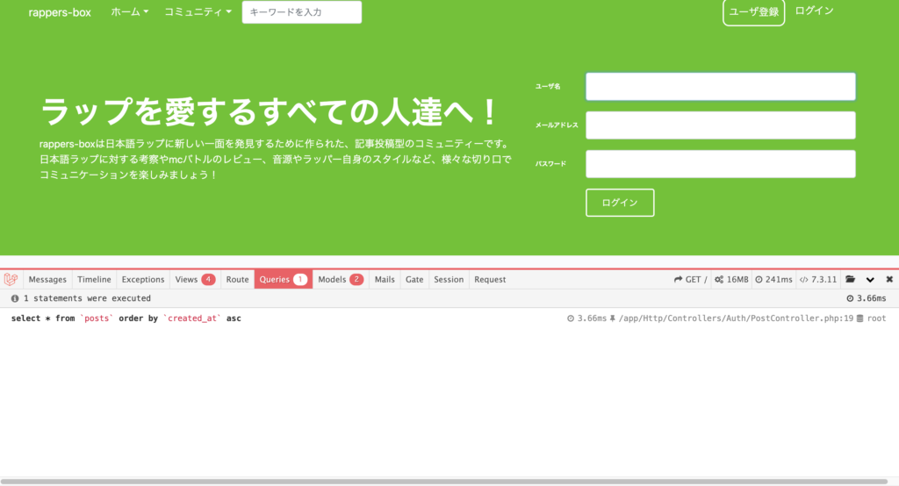

## Laravel Debugbarとは？



こんな感じでブラウザの下に出てくるデベロッパーツールのようなものです。  
みたことある人も多いはず！

まずは導入方法です。

## Laravel Debugbarの導入方法

この記事通りに進めていけば、問題なく導入できるはずです。

[https://larapet.hinaloe.net/2017/03/07/%E9%96%8B%E7%99%BA%E3%81%AB%E6%AC%A0%E3%81%8B%E3%81%9B%E3%81%AA%E3%81%84-laravel-debugbar-%E3%81%AE%E5%B0%8E%E5%85%A5/](https://larapet.hinaloe.net/2017/03/07/%E9%96%8B%E7%99%BA%E3%81%AB%E6%AC%A0%E3%81%8B%E3%81%9B%E3%81%AA%E3%81%84-laravel-debugbar-%E3%81%AE%E5%B0%8E%E5%85%A5/)

config/app.phpへの記述部分が少し迷うかもしれませんので、参考にコードを載せておきます。  
(Laravel Debugbar用と書いてある所が追記部分です。)

```
 'providers' => [

        /*
         * Laravel Framework Service Providers...
         */
        Illuminate\Auth\AuthServiceProvider::class,
        Illuminate\Broadcasting\BroadcastServiceProvider::class,
        Illuminate\Bus\BusServiceProvider::class,
        Illuminate\Cache\CacheServiceProvider::class,
        Illuminate\Foundation\Providers\ConsoleSupportServiceProvider::class,
        Illuminate\Cookie\CookieServiceProvider::class,
        Illuminate\Database\DatabaseServiceProvider::class,
        Illuminate\Encryption\EncryptionServiceProvider::class,
        Illuminate\Filesystem\FilesystemServiceProvider::class,
        Illuminate\Foundation\Providers\FoundationServiceProvider::class,
        Illuminate\Hashing\HashServiceProvider::class,
        Illuminate\Mail\MailServiceProvider::class,
        Illuminate\Notifications\NotificationServiceProvider::class,
        Illuminate\Pagination\PaginationServiceProvider::class,
        Illuminate\Pipeline\PipelineServiceProvider::class,
        Illuminate\Queue\QueueServiceProvider::class,
        Illuminate\Redis\RedisServiceProvider::class,
        Illuminate\Auth\Passwords\PasswordResetServiceProvider::class,
        Illuminate\Session\SessionServiceProvider::class,
        Illuminate\Translation\TranslationServiceProvider::class,
        Illuminate\Validation\ValidationServiceProvider::class,
        Illuminate\View\ViewServiceProvider::class,

        /*
         * Package Service Providers...
         */

　　　　　//Laravel debugbar用
        Barryvdh\Debugbar\ServiceProvider::class,

        /*
         * Application Service Providers...
         */
        App\Providers\AppServiceProvider::class,
        App\Providers\AuthServiceProvider::class,
        // App\Providers\BroadcastServiceProvider::class,
        App\Providers\EventServiceProvider::class,
        App\Providers\RouteServiceProvider::class,

    ],

    /*
    |--------------------------------------------------------------------------
    | Class Aliases
    |--------------------------------------------------------------------------
    |
    | This array of class aliases will be registered when this application
    | is started. However, feel free to register as many as you wish as
    | the aliases are "lazy" loaded so they don't hinder performance.
    |
    */

    'aliases' => [

        'App' => Illuminate\Support\Facades\App::class,
        'Arr' => Illuminate\Support\Arr::class,
        'Artisan' => Illuminate\Support\Facades\Artisan::class,
        'Auth' => Illuminate\Support\Facades\Auth::class,
        'Blade' => Illuminate\Support\Facades\Blade::class,
        'Broadcast' => Illuminate\Support\Facades\Broadcast::class,
        'Bus' => Illuminate\Support\Facades\Bus::class,
        'Cache' => Illuminate\Support\Facades\Cache::class,
        'Config' => Illuminate\Support\Facades\Config::class,
        'Cookie' => Illuminate\Support\Facades\Cookie::class,
        'Crypt' => Illuminate\Support\Facades\Crypt::class,
        'DB' => Illuminate\Support\Facades\DB::class,
        'Eloquent' => Illuminate\Database\Eloquent\Model::class,
        'Event' => Illuminate\Support\Facades\Event::class,
        'File' => Illuminate\Support\Facades\File::class,
        'Gate' => Illuminate\Support\Facades\Gate::class,
        'Hash' => Illuminate\Support\Facades\Hash::class,
        'Lang' => Illuminate\Support\Facades\Lang::class,
        'Log' => Illuminate\Support\Facades\Log::class,
        'Mail' => Illuminate\Support\Facades\Mail::class,
        'Notification' => Illuminate\Support\Facades\Notification::class,
        'Password' => Illuminate\Support\Facades\Password::class,
        'Queue' => Illuminate\Support\Facades\Queue::class,
        'Redirect' => Illuminate\Support\Facades\Redirect::class,
        'Redis' => Illuminate\Support\Facades\Redis::class,
        'Request' => Illuminate\Support\Facades\Request::class,
        'Response' => Illuminate\Support\Facades\Response::class,
        'Route' => Illuminate\Support\Facades\Route::class,
        'Schema' => Illuminate\Support\Facades\Schema::class,
        'Session' => Illuminate\Support\Facades\Session::class,
        'Storage' => Illuminate\Support\Facades\Storage::class,
        'Str' => Illuminate\Support\Str::class,
        'URL' => Illuminate\Support\Facades\URL::class,
        'Validator' => Illuminate\Support\Facades\Validator::class,
        'View' => Illuminate\Support\Facades\View::class,

        // laravel Debugbar用
        'Debugbar' => Barryvdh\Debugbar\Facade::class,

    ],
```

### Laravel Debugbarの使い方

Laravel debugbarには様々な機能がありますが、その中で僕が主に使っている機能を載せておきます。

#### 変数やオブジェクトの出力(var\_dump)

phpでの動作確認では欠かせないvar\_dump。  
javaScriptで言うところのconsole.log()ですね、、

これをLaravel Debugbar上で行えます。

controllerにロギングを記述し、Laravel Debugbarのmessageの部分に指定した内容を表示します。  
詳しくはこの記事に書いてあるので、参考に！

[https://qiita.com/sutara79/items/9fd442a81001842aeba1](https://qiita.com/sutara79/items/9fd442a81001842aeba1)

#### クエリの確認

sqlを確認できます。

クエリにどんなデータが

こちらの記事に手順が載っています。

[https://laraweb.net/practice/4523/](https://laraweb.net/practice/4523/)

その他、表示しているviewやrouteの情報なども確認できます。  
Laravel での開発には欠かせないツールですね！！

## 最後に

注意としてLaravel Debugbarは公開しているプログラムで使わないようにしましょう！  
クエリが確認できると言う事はDB情報が閲覧者に抜き取られてしまう可能性があります。

本番環境では以下のようにLaravel Debugbarを切っておきましょう。

```
APP_DEBUG=false
```

最後まで読んでいただきありがとうございます。  
[Twitter](https://twitter.com/teriteriteriri)もやっているので、興味あればご覧になってください！
