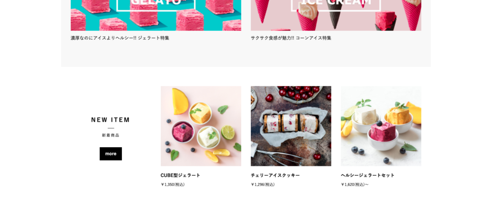

久々にEC-CUBEについてです。  
半年前に制作したECの回収券の案件が入ったので、備忘録がてらまとめていきます。

## なぜ新着商品の自動取得が必要なのか

最初にインストールした直後のEC-CUBEだと新着商品のブロックは手動での記述を行う仕様になっています。

アイスクリームが3つぐらい書いてあるここですね！！



なので、この場所は新商品が更新されるたびに、コードを書き換える必要が出てきます！！  
ですので、ECサイト制作者の方は自動で新着商品が変わる様にしてあげると、クライアントさんに喜ばれやすいかなーと思います。

## 具体的な手順

手順は以下の通りです。

1. /app/Customize/Twig/Extension/TwigExtension.phpを作成する
2. TwigExtension.phpに新着商品を表示するためのコードを記述
3. コンテンツ管理のブロック管理から新着商品のコードを書き換える
4. css管理からcssでスタイリング

1つずつ詳しく見ていきましょう！！

### 1 TwigExtension.phpを作成

/app/Customize/Twig/Extension/TwigExtension.phpを作成します。

ファイルのパスを間違えない様に作りましょう！！

## 2.TwigExtension.phpにコード記述

さてTwigExtension.phpを作成していきます。  
コード内容はphpになるので、理解が難しい人は完全コピペでも動かせます。

```
<?php
namespace Customize\Twig\Extension;
 
use Doctrine\Common\Collections;
use Doctrine\ORM\EntityManagerInterface;
use Eccube\Common\EccubeConfig;
use Eccube\Entity\Master\ProductStatus;
use Eccube\Entity\Product;
use Eccube\Entity\ProductClass;
use Eccube\Repository\ProductRepository;
 
class TwigExtension extends \Twig_Extension
{
    private $entityManager;
    protected $eccubeConfig;
    private $productRepository;
 
    /**
        TwigExtension constructor.
    **/
    public function __construct(
        EntityManagerInterface $entityManager,
        EccubeConfig $eccubeConfig, 
        ProductRepository $productRepository
    ) {
        $this->entityManager = $entityManager;
        $this->eccubeConfig = $eccubeConfig;
        $this->productRepository = $productRepository;
    }
    /**
        Returns a list of functions to add to the existing list.
        @return array An array of functions
    **/
    public function getFunctions()
    {
        return array(
            new \Twig_SimpleFunction('CustomizeNewProduct', array($this, 'getCustomizeNewProduct')),
        );
    }
 
    /**
        Name of this extension
        @return string
    **/
    public function getName()
    {
        return 'CustomizeTwigExtension';
    }
 
    /**
        新着商品を10件返す
        @return Products|null
    **/
    public function getCustomizeNewProduct()
    {
        try {
            $searchData = array();
            $qb = $this->entityManager->createQueryBuilder();
            $query = $qb->select("plob")
                ->from("Eccube\\Entity\\Master\\ProductListOrderBy", "plob")
                ->where('plob.id = :id')
                ->setParameter('id', $this->eccubeConfig['eccube_product_order_newer'])
                ->getQuery();
            $searchData['orderby'] = $query->getOneOrNullResult();
 
            // 新着順の商品情報10件取得
            $qb = $this->productRepository->getQueryBuilderBySearchData($searchData);
            $query = $qb->setMaxResults(10)->getQuery();
            $products = $query->getResult();
            return $products;
 
        } catch (\Exception $e) {
            return null;
        }
        return null;
    }
}
?>
```

### 3.コンテンツ管理のブロック管理から新着商品のコードを書き換える

実際にコードをいじる前に、一回キャッシュ管理の中のキャッシュ削除を行っておきましょう。  
2.でTwigファイルを作成したので、その変更を反映させます

次に管理画面からブロック内のコードをいじっていきます。

中身はこんな感じですね！！

```


<div class="ec-role">
    <div class="ec-newItemRole">
    
    	<div class="ec-secHeading">
            <span class="ec-secHeading__en">NEW Goods</span>
            <span class="ec-secHeading__line"></span>
            <span class="ec-secHeading__ja">新入荷商品</span>
        </div>
    
        <div class="ec-newItemRole__list">
 
            
            <div class="ec-newItemRole__listItem">
                <a href="{{ url('product_detail', {'id': Product.id}) }}">
                    
                    <p class="ec-newItemRole__listItemTitle">{{ Product.name }}</p>
                    <p class="ec-newItemRole__listItemPrice">
                    
                        
                            {{ Product.getPrice02IncTaxMin|price }}
                        
                            {{ Product.getPrice02IncTaxMin|price }} ～ {{ Product.getPrice02IncTaxMax|price }}
                        
                    
                        {{ Product.getPrice02IncTaxMin|price }}
                    
                    </p>
                </a>
            </div>
            
 
        </div><!-- .ec-newItemRole__listItem end -->
        
        <div clas="ec-newItemRole__listItemHeading ec-secHeading--tandem">
        	<a class="ec-inlineBtn--top" href="{{ url('product_list') }}?orderby={{eccube_config.eccube_product_order_newer}}">» 全商品一覧はこちら</a>
        </div>
        
    </div><!-- .ec-newItemRole end -->
</div><!-- .ec-role end -->

```

#### 4.css管理からcssでスタイリング

cssは制作したいデザインに合わせてよしなにやってください！


こんな感じで5個で1列にするパターンのcssはこんな感じです！！

```
* カスタマイズ用CSS */
/* トップページ新着商品リスト */
.ec-newItemRole .ec-newItemRole__list{
    flex-wrap:wrap;
}
.ec-newItemRole .ec-newItemRole__list .ec-newItemRole__listItem{
    width:20%;
    margin:0 auto 20px auto;
    padding:0 16px;
}
.ec-newItemRole .ec-newItemRole__list .ec-newItemRole__listItem a{
    max-width:96%;
    display:block;
}
.ec-newItemRole .ec-newItemRole__listItemPrice{
    color:#cc0000;
    font-weight:bold;
    text-align: right;
    font-size:18px;
}
.ec-newItemRole__listItemHeading{
    text-align:center;
}
.ec-inlineBtn--top{
      text-align:center;
}


@media screen and (max-width:768px){
    
    .ec-newItemRole .ec-newItemRole__list .ec-newItemRole__listItem{
        width:33.3%;
    }
    
}
```

これで新着商品を自動で取得できる様になったと思います！！

EC-CUBE4.0はまだまだ情報が少ないので、色々作りながらアウトプットしていけたらと思います。

最後まで読んでいただきありがとうございます。  
[Twitter](https://twitter.com/teriteriteriri)もやっているので、興味あればご覧になってください！
