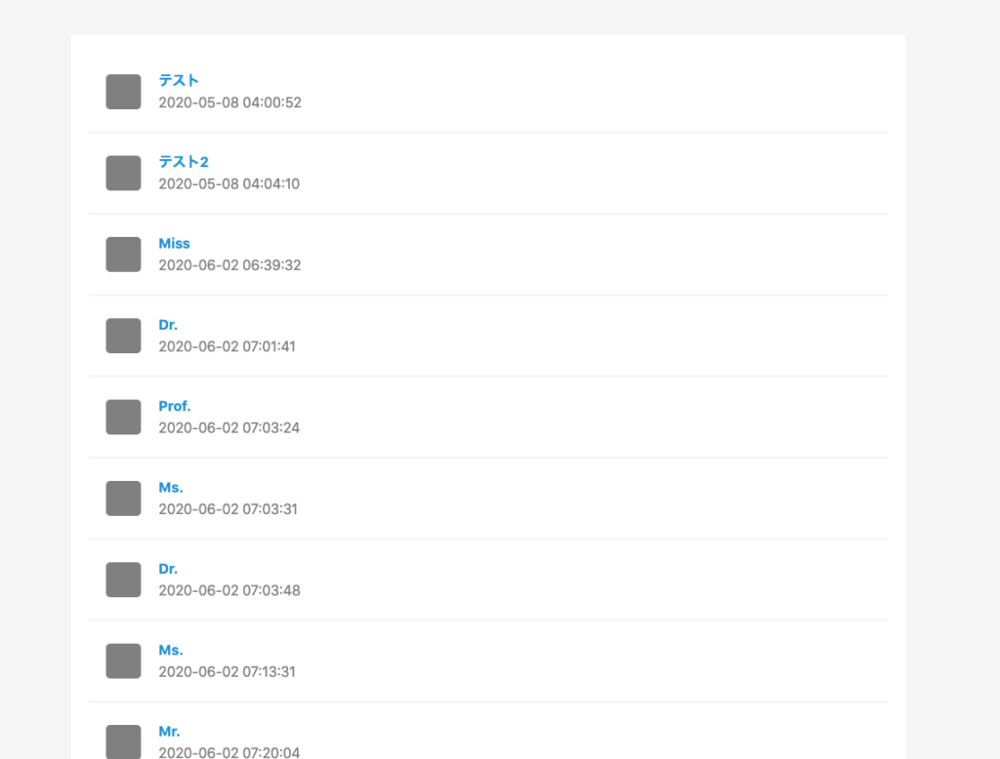
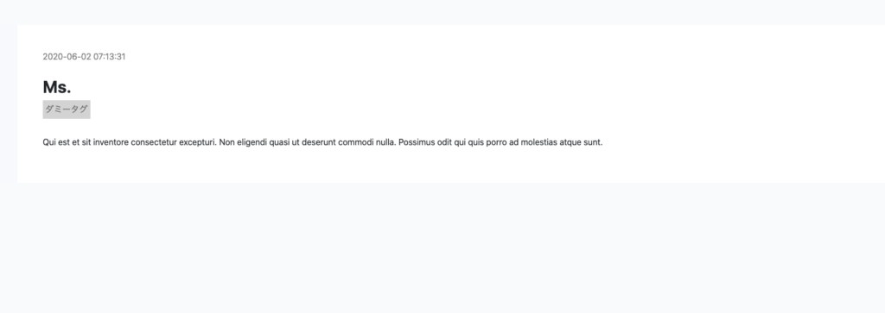

テスト用にダミーデータが欲しいときの方法を記します。  
Laravelにあるfactoryを使えば、このようにダミーデータを50件直ぐに用意することが可能です。

一覧画面



内容



## 手順

### 前提

DBが既にある前提でダミーデータを生成していきます。  
今回は投稿を複製したいので、postテーブルを使います。

構造はこんな感じ

```
  public function up()
    {
        Schema::create('posts', function (Blueprint $table) {

            $table->bigIncrements('id');
            $table->integer('user_id');
            $table->string('title');
            $table->string('tag1');
            $table->string('tag2')->nullable();
            $table->string('tag3')->nullable();
            $table->text('body');
            $table->timestamps();
        });
    }
```

### ①factoryを生成

```
php artisan make:factory PostFactory
```

こちらのコマンドでfactoryが database/factories配下に作成されます。

### ②PostFactory.phpにコールバック関数を定義する

```
<?php

/** @var \Illuminate\Database\Eloquent\Factory $factory */

use App\Post;
use App\User;
use Faker\Generator as Faker;

$factory->define(Post::class, function (Faker $faker) {
    return [
        'user_id' => User::pluck('id')->random(),
        'title' => $faker->title,
        'tag1' => "ダミータグ",
        'body' => $faker->text,
    ];
});
```

ダミーデータとして登録したい内容は「title」「tag」「body」なので、それらをコールバック関数として定義します。

```
 $faker->title
```

の様に$fakerを使うとランダムで値を取得できます。  
fakerで取得できるデータはこんな感じ。

[https://qiita.com/Sa2Knight/items/fb82be7551cc84764267](https://qiita.com/Sa2Knight/items/fb82be7551cc84764267)

### ③tinkerで作成できるか試してみる

tinkerはお手軽にコマンドを試したりデバックができるツールです。  
簡単な概要はこちら

[https://qiita.com/juve\_534/items/96dc6e7e0652dced1428](https://qiita.com/juve_534/items/96dc6e7e0652dced1428)

早速作ったfactoryを試していきます。

```
php artisan tinker
```

これでtinkerを呼びます。

```
>>> factory(App\Post::class)
=> Illuminate\Database\Eloquent\FactoryBuilder {#3074}
```

と打つとちゃんとPostFactoryクラスが反映されている事が分かります。

```
factory(App\Post::class)->create()
```

でダミーデータが生成されます。

こんな感じですね。

```
=> App\Post {#3053
     user_id: 2,
     title: "Ms.",
     tag1: "ダミータグ",
     body: "Qui est et sit inventore consectetur excepturi. Non eligendi quasi ut deserunt commodi nulla. Possimus odit qui quis porro ad molestias atque sunt.",
     updated_at: "2020-06-02 07:13:31",
     created_at: "2020-06-02 07:13:31",
     id: 8,
   }
```

「user\_id」、「tatile」、「body」がランダムの値になっています。

ブラウザ側で見てもちゃんとデータは生成されていますね。


### seederを使って量産する

factoryでデータが作れたので、次はseederを使ってデータを量産していきます。

databases/seeds/databaseSeeder.phpに記述を書いていきましょう。

```
<?php

use Illuminate\Database\Seeder;
use App\Post;

class DatabaseSeeder extends Seeder
{
    /**
     * Seed the application's database.
     *
     * @return void
     */
    public function run()
    {
        factory(Post::class, 50)->create();
    }
}
```

内容はシンプルで、Postクラスを呼び出して50個データを作成できます。

コマンドラインにて

```
php artisan db:seed
```

を打ち込めばデータが50個ほど投入されています。  
これにて完了。
