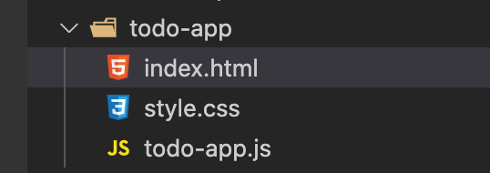

## はじめに

javaScriptでtodoリストを作ってみましょう。  
基本的なDMO操作や、関数、配列の使い方あたりの理解だがチェックできます。

### 完成物

### 要件

```
 todoアプリ
// ・todoの一覧を表示
// ・追加機能でtodoを追加できる
// ・todoを削除できる
// ・検索機能で一致するtodoだけを表示する
// ・動作する旅に「残りのタスクは~個です。」の〜が更新される
```

## レッツチャレンジ！！！

実際に手を動かしてやってみましょう。

### 大まかな流れ

①htmlで必要な要素を書く  
②cssファイルを作り、デザインと整える  
③タスク追加機能を作る  
④タスク削除機能を作る  
⑤検索機能を作る  
⑥残りのタスク量を表記する

## 解説

### ①htmlで必要な要素を書く

### ②cssファイルを作り、デザインを整える

htmlを書く前にまずはディレクトリ の構成をみましょう。  
今回はこの様に、html、css、jsファイルをそれぞれ1つずつ作る。



htmlファイル内はざっとこんな感じ。

```
<!DOCTYPE html>
<html>
    <head>
        <link rel="stylesheet" href="style.css">
    </head>
    <body>
        <h1>todoアプリ</h1>
        <p>todo一覧</p>
        
        <ul id='todo-list'>
        </ul>
        <div>
            <p>----------------------------------------------------------</p>
            <div>
                <input id="add-new-todo" type="text" placeholder="todo追加">
                <button id="add-todo">追加</button>
            </div>
                <input id="search-todo" type="text" placeholder="検索ワード">
                <button id="search">検索</button> 
                <p id="todo-count"></p>   
        </div>       
        <script src="todo-app.js"></script>
    </body>
</html>
```

cssはこんな感じになる

```
ul {
    list-style: none;
}

li{
    display: flex;
    align-items: baseline
}

li> p ,input,button{
    margin:10px;
}
```

### ③タスク追加機能を作る

さてここから本番。JavaScriptでの処理をちゃんと書いていく形になる。

タスク追加機能の流れとして

・引数にタスク名で、追加されたタスクのDOMを生成する関数を作る  
・追加ボタンが押された時に発火するイベントを作る

となる。

#### 引数にタスク名で、追加されたタスクのDOMを生成する関数を作る

関数名をcreateTodoListとして、task名を受け取ったらそれに応じてli、p、buttonを生成する関数を作る。

```
// タスクをリストに追加
const createTodoList = function(task){
    const html=`
    <li>
    <p id="todo" class="todo">${task}</p>
    <button id="todo-delete" class="delete">削除</button>
    </li>
    `
    todoList.innerHTML += html
}
```

使い方はこんな感じ。

```
const task = "犬の散歩"
createTodoList("task")
```

引数にいれた「犬の散歩」をタスク名に入れた、DOMが生成される。


#### 追加ボタンが押された時に発火するイベントを作る

次は追加ボタンで発火するイベントを作る。

```
//追加でcreateTodoListを発火する
document.querySelector('#add-todo').addEventListener('click',function(e){
    const task = document.querySelector('#add-new-todo').value.trim()

    //空での追加を防ぐ
    if(!task == ''){
    createTodoList(task)
    document.querySelector('#add-new-todo').value = ''
    }
})
```

で、id (add-todo）がクリックされた時に、処理内容を実行するイベントが出来た。

中の処理では、以下のことを行っている。

・taskにinputタグ内の入力値を代入  
・if文でtinputの入力値が空の場合を除外  
・先ほど作ったcreateTodoLIstにタスク名を渡して実行  
・タスクの追加が終わったので、inputタグ内を空にする

```
//taskにinputタグ内の入力値を代入
const task = document.querySelector('#add-new-todo').value.trim()

    //if文でtinputの入力値が空の場合を除外
    if(!task == ''){

　　 //先ほど作ったcreateTodoLIstにタスク名を渡して実行
    createTodoList(task)

    //タスクの追加が終わったので、inputタグ内を空にする
    document.querySelector('#add-new-todo').value = ''
    }
```

これにてタスク追加機能が完成。

### ④タスク削除機能を作る

次にタスクの削除機能を作ります。

削除機能では以下のことを行います。

・削除ボタンで発火するイベントの作成  
・li、p、buttonタグを全て削除する

```
//削除ボタンで発火するイベントの作成
todoList.addEventListener('click',function(e){

    //li、p、buttonタグを全て削除する
    if(e.target.classList.contains('delete')){
        e.target.parentElement.remove();
    }
})
```

classLIstを使うことでdelteクラスが含まれている要素を親ごと取得して、remove()で削除している。

### 検索機能を作る

検索機能の大まかな流れとして

・追加されたtodoを配列に格納したtodosを作る  
・検索ワードを格納するfiltersを作る  
・filtersとtodosが一致した物のみで構成される配列filterTodosを作る  
・todos(タスク一覧)、filters(検索ワード)を引数として、それらが一致していたら、新しいタスク一覧であるfilterTodosをレンダリングする関数renderTodosを作る  
・filterTodosを作ったら検索ワードは空にする  
・タスク一覧のDOM内を空にして、タスクの重複を防ぐ  
・filterTodosをforEachで1つずつ出力する  
・検索ボタンで発火するイベントを作る

```
//追加されたtodoを配列に格納したtodosを作る
const todos = Array.from(document.querySelectorAll('#todo'))

//検索ワードを格納するfiltersを作る
const filters = {
    searchText: ''
}

//todos(タスク一覧)、filters(検索ワード)を引数として、それらが一致していたら、新しいタスク一覧であるfilterTodosをレンダリングする関数renderTodosを作る
const renderTodos =function(todos,filters){

    //filtersとtodosが一致した物のみで構成される配列filterTodosを作る
    const filterTodos = todos.filter(function(todo){
　　　　　
　　　　　//todoのに格納されたタスク名に、filters.searchTextに格納した文字列が含まれている物だけがreturnされる
        return todo.textContent.toLowerCase().includes(filters.searchText.toLowerCase())
    })

    //フィルタリングしたら検索ワードのinputは空にする
    document.querySelector('#search-todo').value = ''

    //forEachでfilterTodosの配列を出力する前に、タスク一覧のDOM内を空にして、タスクの重複を防ぐ
    document.querySelector('#todo-list').innerHTML=''

    //filterTodosをforEachで1つずつ生成する
    filterTodos.forEach(function (todo) {
        createTodoList(todo.textContent)
    })

}
```

これにより、検索ワードfilters、タスク一覧todos、todosとfiltersの文字列が一緒の物のみタスク一覧に追加するrenderTodosが出来上がった。

これらを使い、検索が押された場合に発火するイベントを作り、その都度、todos、filtersの値を更新しながらrenderTodosを実行する。

```
//検索ボタンでの発火
document.querySelector('#search').addEventListener('click',function(e){

　 　//todosの配列の値を更新する
    const todos = Array.from(document.querySelectorAll('#todo'))

    //検索欄に入力された値が、filterワードとして格納される
    filters.searchText =　document.querySelector('#search-todo').value
    renderTodos(todos, filters)
})
```

これにて検索機能完成！！！

### 動作する旅に「残りのタスクは~個です。」の〜が更新される

これで最後の機能？です。

大まかな流れとして

・pタグ作る  
・pタグにJavaScriptで変数を格納  
・各イベント時に変数の更新をする

最初のpタグを作る！はこれだけです。htmlにpタグを作ってidを振っておいてください。  
中身はJs側で入れていくので、空で大丈夫です。

```
<p id="todo-count"></p>   
```

Js側では、以下の文言をさいしょのほうと、各イベント内に入れます。  
todosの配列が追加、検索の際に更新されてlengthが変わってきます。

```
 const todos = Array.from(document.querySelectorAll('#todo'))
document.querySelector('#todo-count').textContent = `残りのタスクは${todos.length}個です`
```

## 完成

以上でJavaScriptで　todoアプリを作る事ができました。

今回の内容が自分1人で出来る様になると、JavaScriptの文法の基礎の、DOM操作、関数、配列、オブジェクトあたりは使いこなせる様になります。

検索機能の辺りは処理が複雑で工数も多いので、混乱しやすいです。  
今回で基礎的な文法に不安があった方は、こちらの記事で基礎を復習してみて下さい。

https://terrblog.com/javascript%e3%81%ae%e5%9f%ba%e7%a4%8e%e6%96%87%e6%b3%95%e3%81%a8%e9%96%a2%e6%95%b0%e3%81%ae%e3%83%81%e3%82%a7%e3%83%83%e3%82%af%e3%83%86%e3%82%b9%e3%83%88/

https://terrblog.com/%e5%ae%b6%e8%a8%88%e7%b0%bf%e6%a9%9f%e8%83%bd%e3%82%92%e4%bd%9c%e3%82%8d%e3%81%86javascript%e3%83%81%e3%82%a7%e3%83%83%e3%82%af%e3%83%86%e3%82%b9%e3%83%88/

それではまた。
