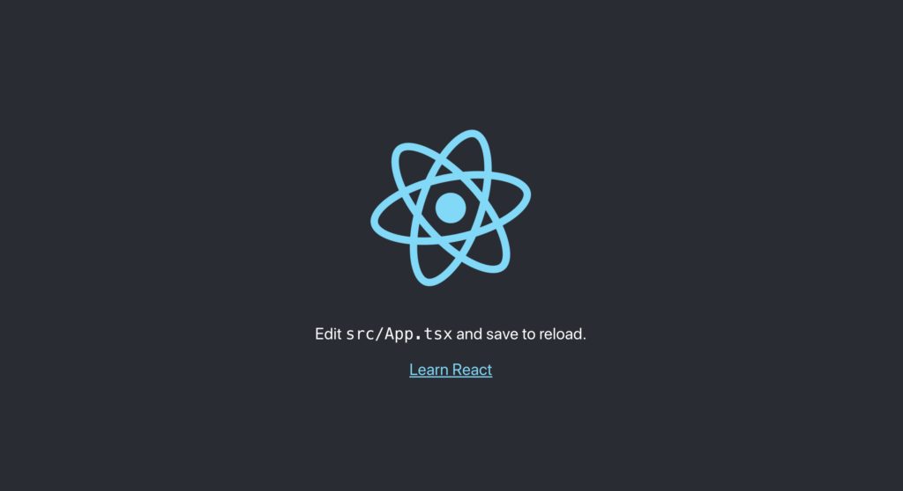
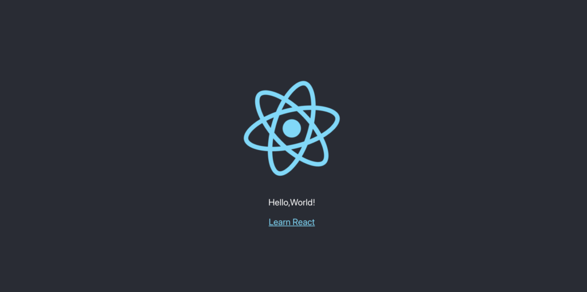

## create-react-appとは

Facoebookがreact発表後から4年経ってようやく作った、非公式ながら、ほぼ公式のコマンド。テンプレート のスケルトンができる。

## 構成

作られたreacrプロジェクトは以下の3つから構成される。

### react本体

react本体のパッケージ。

### react-dom

DOMを抽象化して、react側で操作できる様にするレンダラーのパッケージ。

### react-script

様々なパッケージの集まり。Babel、webpack、Jest、PWA化などに対応している。

## create-react-appを実行

さて、実際にreactを手元にインストールしてみる。

ターミナルで下記コマンドを実施する。

```
$ npx create-react-app hello-world --template typescript
```

hello-worldはプロジェクト名。適宜変更する。

\--template typescriptを使う事で、TypeScriptのテンプレートを指定している。

```
We suggest that you begin by typing:

cd hello-world 
yarn start

Happy hacking!
```

この様な文言が出たらインストール成功。

指示通り「cd hello-world」「yarn start」を実行すると、ブラウザにデフォルトの画面が現れる。



## create-react-appの中身を見ていく

まずpublic/index.htmlを確認する。

表示されているbodyの部分を確認するとこの様になる。

```
<body>
    <noscript>You need to enable JavaScript to run this app.</noscript>
    <div id="root"></div>
</body>
```

id="root"の部分がメインなので、scr/index.tsxを確認する。

### src/index.tsx

```
ReactDOM.render(
  <React.StrictMode>
    <App />
  </React.StrictMode>,
  document.getElementById('root')
);
```

第一引数：reactコンポーネントをDOMに描画

第二引数：指定のHTML要素に上書き。  
今回は「document.getElementById('root')」としている為、index.htmlの<div id="root"></div>に第一引数のDOMを描画する。

### <React.StrictMode>とは？？

index.tsxの<App/>のラッパーである<React.StrictMode>はStrictモードを有効にするラッパーである。

Strictモードを有効にする事で、潜在的な問題点をWorningで教えてくれる。

### src/App.tsx

index.tsxの<App />の中身はApp/tsxに記載されている。

App.tsxはReactコンポーネントにあたる。

**Reactアプリケーションはコンポーネントの組み合わせで構成される！！**

コンポーネントはパスカルケース（大文字始まり）で表記する為、今回はApp.tsxとなる。

コンポーネントは関数 or クラスで実装される。

今回は関数で描かれている。

```
import React from 'react';
import logo from './logo.svg';
import './App.css';
function App() {
  return (
    <div className="App">
      <header className="App-header">
        
        <p>
          Edit <code>src/App.tsx</code> and save to reload.
        </p>
        <a
          className="App-link"
          href="https://reactjs.org"
          target="_blank"
          rel="noopener noreferrer"
        >
          Learn React
        </a>
      </header>
    </div>
  );
}
export default App;
```

今回はここのファイルを編集する。

hello worldと表記するために、<p>タグの部分を変更し下記の様にする。

```
import React from 'react';
import logo from './logo.svg';
import './App.css';

function App() {
  return (
    <div className="App">
      <header className="App-header">
        
        <p>
          Hello,World!
        </p>
        <a
          className="App-link"
          href="https://reactjs.org"
          target="_blank"
          rel="noopener noreferrer"
        >
          Learn React
        </a>
      </header>
    </div>
  );
}

export default App;
```

すると以下の様に「hello world」が出力されれば完成！！！


