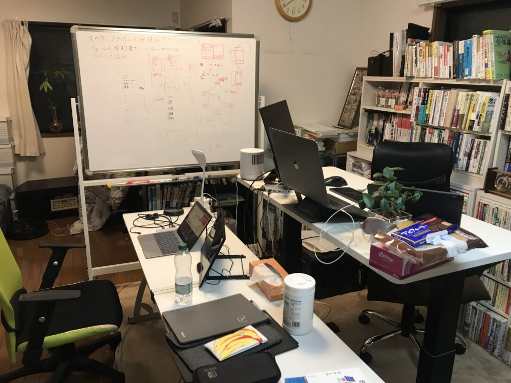
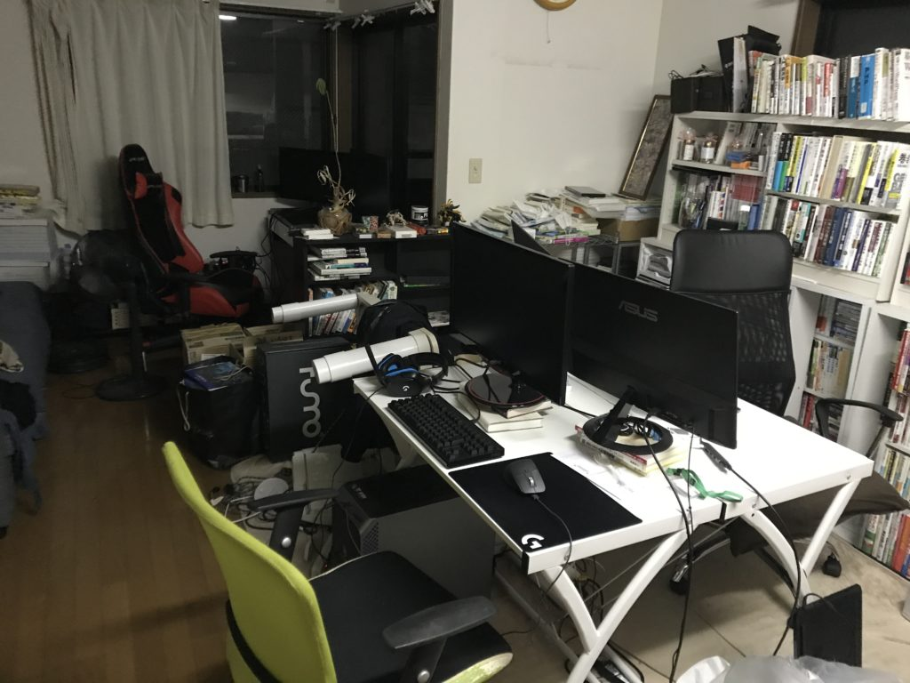

## はじめに

今のシェアハウスに住み始めたのが、2020年の4月なので、半年が過ぎたかなーって感じです。

はやいですね…

今回は「シェアハアウスに住んでみて実際どうだったか！？」をフリーランスエンジニアという観点で、振り返っていきました。

## どんなシェアハウスに住んでいるのか？

新宿と言っていますが、最寄りは西新宿五丁目という駅で、新宿からは徒歩20分ぐらいの場所です。  
3階建ての一軒家に4人で暮らしているので、スペース的には同じ価格帯で1人暮らししているよりも多くを占領できているかなーという印象です。

住み始めた当初はリビングでみんな作業していた為、リモートオフィスの様な空気感が出ていました。

現在は1人が事務所を借りてほぼ帰らなくなり、リビングは少しゆったりとした感じになりました。

## シェアハウス生活の振り返り

### 家のグレードを上げられるのがQOLが上がって凄く良い！

まあ当たり前の話なんですけど、何人かで一緒に住んでいる分、1人で住むよりも家のグレードは上がります！！

これがフリーランスで在宅の身からすると凄く嬉しい！！  
例えば仕事机やキッチン、お風呂などが共用とはいえ実家に近いレベルで整っている感じです。

お風呂は本当に良くて、ちゃんとバスタブが広くて毎日浴槽に浸かれる環境って何にも変えがたいと思っています。

### 色々シェアできる

さっきの家の写真の背景からも分かる通り、この家にはでっかい本棚があり、技術書もたくさんあります。  
2~3年目のエンジニアが住んでいるので、まだまだみんな勉強中であり、新しい技術書がガンガン追加されていきます。

会社に勤めていると、会社の経費で買ったり、オフィスに置いてあったりする場合が多いですが、フリーランスだと自腹が基本なので、シェアできるのはとても助かります。

また毎週読んでいるジャンプや、家具など色々とシェアできるのは1人暮らしで買うよりも割安だと思います。

### 同世代の人と雑談ができる

この半年を振り返ると、コロナの影響もあり、人とリアルで会う機会がめっきり減りました。  
エンジニアという仕事柄もあって、案件のPMやクライアントとの打ち合わせ以外はテキストベースでの会話がほとんどになってきます。

1日仕事で全く話さない！なんていうの全然あり得ます。  
となると、軽い気持ちで雑談ができるシェアハウスの人はとても重宝します。ストレス解消とかになってそう。

週末はみんなでフォートナイトをしたりもするので、フリーランスで感じがちな孤独感などは一切感じていないです。

### 仕事が捗る

他人の目があることによって仕事が捗ります。  
僕は自分に甘いので、1人暮らしでフルリモートだと、平気で何時間もyoutubeとかみちゃう人間です！

ですが、作業スペースを教養のリビングにすることで、集中して目の前のタスクに臨みやすい環境を手に入れる事が出来ました。

### 家事が被る事がある

同居人と料理やお風呂が被って待つ場合があります。  
僕の家だと、生活時間がみんな違うので、ドンピシャでは被りませんが、、

洗濯機なども1台しかない為、他人が回していると使えなかったりします。  
最近は雨も多かったので、コインランドリーの割合が多かったです！

### みんなミーティングをしていると、声が入ってくる

朝の時間帯に多いんですが、会議が被って音が入っちゃうパターンですね。  
ちょっと困ります。

### ゴミの溜まるペースが鬼早い

1人暮らしの3倍ゴミが出ます！

45Lのポリビニールが1~2日ですぐいっぱいになります。  
ちゃんとしないと、すぐゴミ屋敷になるので気をつけています。

### 掃除の分担が曖昧

一応当番表を作ったのですが、効力を持っていません。

結果、誰も掃除を行わなくなった為、現在は[casy](https://casy.co.jp/)という家事代行サービスで月1ぐらいで水回りとリビングを掃除してもらっています。

## シェアハウスに半年住んでみての総括

### 若いうちはシェアハウスは超アリ

若いうちは金銭面で節約できたり、インプットやアウトプットの機会が増えたりと、良い事尽くめだと思います。

27歳ぐらいまではシェアハウスに住めそうかなーっていうのが個人的な所感です。

### 住む地域は1年単位で変えたい

フルリモートで生活していると、仕事でオフィスに通っているよりも、家の周りの地域にスグ飽きます。  
シェアハウスに住んでいる人からの情報もあるので、開拓するペースが早いんですね。

1年もいると開拓し尽くした感じが出ます。僕自身はいろんな街に住んでみたいと思っているので、シェアハウスするなら、ちょくちょく場所は変えたいなーと思いました。

### 人と暮らすのは楽しい！！

なんだかんだ人と暮らすのは良いです！  
ポーカーしたり、フォートナイトしたり、相席食堂を一緒に見たりなどの団欒が、仕事からシームレスで出来る空間はとても楽しいし、年取ったら出来なさそうだなーとも思います。

コロナの雰囲気も落ち着いてきたのでシェアハウスで黙々会などのイベントも開催していきたいなー。

最後まで読んでいただきありがとうございます。  
[Twitter](https://twitter.com/teriteriteriri)もやっているので、興味あればぜひ
