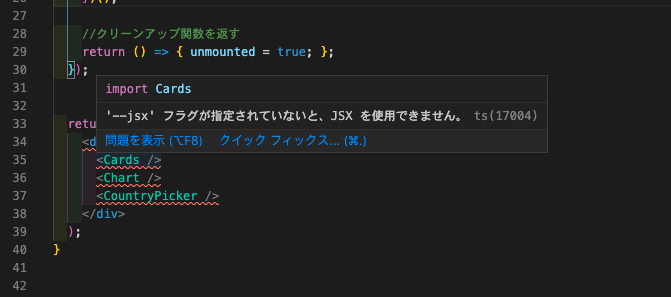
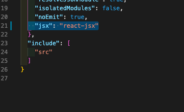
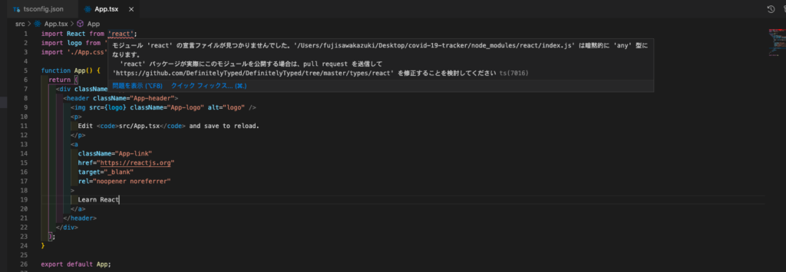

## '--jsx' フラグが指定されていないと、JSX を使用できません

これはcreate-react-app直後からエラーが出ていました。  
原因はtsconfig.jsonの設定ミスです。

react-jsx→reactにしてあげれば解決します。

参考：[https://www.it-swarm-ja.tech/ja/reactjs/%e3%80%8cjsx%e3%80%8d%e3%83%95%e3%83%a9%e3%82%b0%e3%81%8c%e6%8c%87%e5%ae%9a%e3%81%95%e3%82%8c%e3%81%a6%e3%81%84%e3%81%aa%e3%81%84%e9%99%90%e3%82%8a%e3%80%81jsx%e3%82%92%e4%bd%bf%e7%94%a8%e3%81%a7%e3%81%8d%e3%81%be%e3%81%9b%e3%82%93/838744128/](https://www.it-swarm-ja.tech/ja/reactjs/%e3%80%8cjsx%e3%80%8d%e3%83%95%e3%83%a9%e3%82%b0%e3%81%8c%e6%8c%87%e5%ae%9a%e3%81%95%e3%82%8c%e3%81%a6%e3%81%84%e3%81%aa%e3%81%84%e9%99%90%e3%82%8a%e3%80%81jsx%e3%82%92%e4%bd%bf%e7%94%a8%e3%81%a7%e3%81%8d%e3%81%be%e3%81%9b%e3%82%93/838744128/)

## React importエラー

Reactのimport時に宣言されていないと言うエラーが出ています。

n`pm i -D @types/react`　で解決します。

## **tsconfig.json**のオプション

全てのオプション

[https://qiita.com/ryokkkke/items/390647a7c26933940470](https://qiita.com/ryokkkke/items/390647a7c26933940470)

## scss導入

この記事を参考に導入

https://qiita.com/toshikisugiyama/items/d413de79011a6e538053

node-sassのversionによってはエラーが出る。

ver4.0以下の場合はこちらでインストール

`yarn add node-sass@4.14.1`
