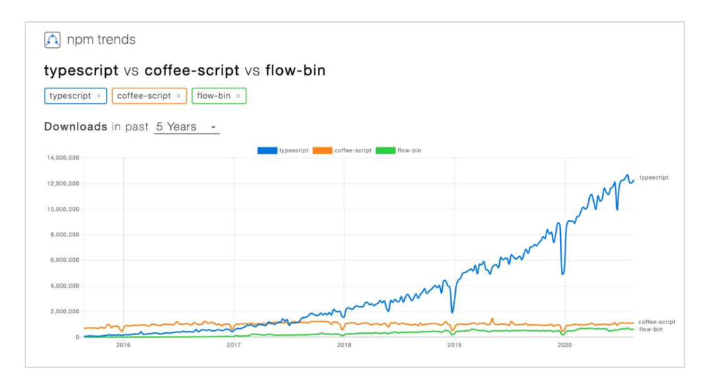
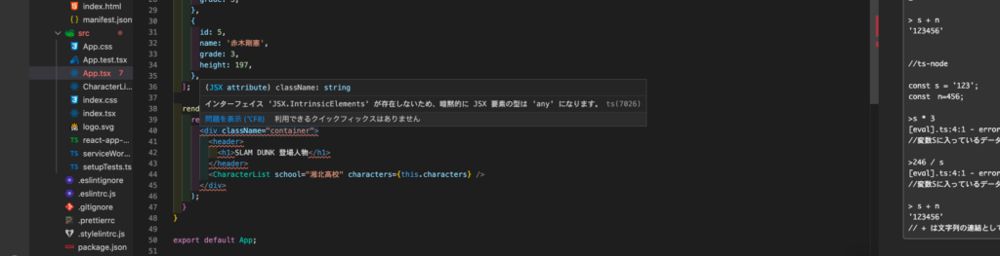

## TypeScriptとは？JavaScriptの上位互換

そもそも、TypeScriptとはAltJSの1種です。  
AltJSとはAlternative JavaScriptの略語で、JavaScriptの代替言語を意味しています。  
書いたものをJavaScriptに変換してくれる言語の事です。

TypeScriptはマイクロソフトが開発したAltJSで、一言で表すと「型定義ができるJavaScript」といった感じです。  
完全にJavaScriptのスーパーセット(上位互換)で、最新のJavaScript(ES2018)の仕様となっています。

特にTypeScriptで用いる「型」は、Go、Rust、Kotlin、Swiftなどにも用いられているトレンドの特徴となっています。

画像は2020年9月の際のAltJSのダウンロード数を表示したもので、TypeScriptはAltJSの中で圧倒的に人気です。

## TypeScriptの導入事例

TypeScriptが大きなトレンドとなっている証拠として様々な大規模サービスにも使われています。  
AirbnbはReacr+TypeScript(約半分)で作られていて、SlackもReact+TypeScriptのペアで作られています。

2017年にGoogleが社内の標準言語にもなっています。

## TypeScriptのモダンな3つの特徴  

TypeScriptがJavaScriptから進化した特徴として挙げられるのが、以下の3点です。

・『静的型付け』  
・『型推論』  
・『Null 安全性 』

1つずつ詳しく説明していきましょう。

### 静的型付け

#### 動的型付け

対義語にあたる動的型付けを使っている言語には、Ruby、PHP、Pythonなどがあります。  
いちいち型を厳格に決めなくても定義して使える点が魅力でしたが、型チェックがなかった為、バグを減らすためにテストを書く必要があり、TDD(テスト駆動開発)が流行りました。

#### 静的型付け

静的型付けは反面、定義する際に型を決めなくてはならず、それに反するとコンパイルエラーを吐きます。  
厳格な作るにする事で、型の不整合をエラーで未然に知らせてくれる点が魅力です。

次に説明する型推論の助けもあり、型を厳格に定義する事が気軽になった事で、静的型付け言語は広まっていきました。

### 型推論

型推論はいちいちプログラムで型を定義しなくても、言語処理が文脈から型を推測して型をつけてくれる機能です。  
これにより、今まで動的に型を定義していた人達も手軽に静的型付け言語を導入できる様になりました。

### Null安全性

プログラムで一番多いバグの原因として null アクセスの例外が挙げられます。  
nullになる可能性をコーディング時点で弾ききれない事が多いからです。

しかし、TypeScriptでは、コンパイルの段階でnull アクセスエラーになる可能性のあるコードをチェックしてはじいてくれます。  
これによりnullアクセスによるエラーを未然に防ぐ事が可能となったのです。

## TypeScriptとVScodeの相性の良さ

上記で挙げたTepeScriptの特徴ですが、VScodeを使う事でより効果を実感できます。  
同じマイクロソフトが作っていると言うこともあり、互換性は抜群で、いちいちコンパイルしなくてもリアルタイムで問題箇所を指摘してくれます。

## まとめ

今回はJavaScriptのAltJSの1つで、最も勢いがあるTypeScriptの特徴について触れていきました。  
TypeScriptはまだまだ歴史が浅いですが、フロントエンドのReact、Angualarなどとの相性も良く、今後中心となっていくと見込まれている言語です。

著者自身の経験としても、2020年に入ってからはTypeScriptで書かれている現場をよく見かけるので、フロントエンドでの重要度は今後増していくと気がしています。

型の書き方やTypeScriptの御作法は、またの機会に執筆予定です。

  
最後まで読んでいただきありがとうございます。  
[Twitter](https://twitter.com/teriteriteriri)もやっているので、興味あればご覧になってください！
