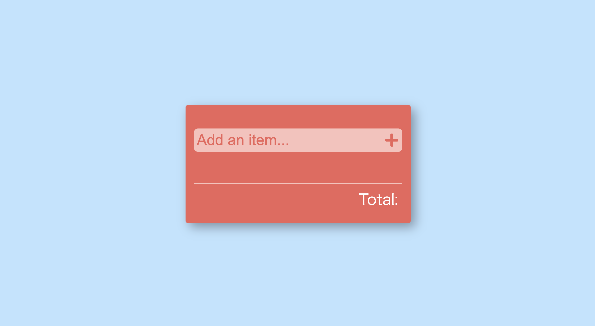

# はじめに

これはReact Hooksの入門者向けの記事で、今回はuseStateを扱っています。  
前半部分でReact HooksやuseStateの解説を行い、後半部分で関数コンポーネントを使った買い物リストの実装をチュートリアル形式で行っています。

チュートリアルではfreeCodeCampに掲載されていた[How to Build a Shopping List Using React Hooks (w/ Starter Code and Video Walkthrough)](https://www.freecodecamp.org/news/how-to-build-a-shopping-list-using-react-hooks-w-starter-code-and-video-walkthrough/)を実例として進めていきながら、解説を織り交ぜています。

React学習の参考になれば幸いです。

Githubリポジトリ

https://github.com/gunners6518/shopping-list

# このチュートリアルで学べる事

React Hooksの基礎にあたるuseStateの使い方の基礎。  
関数コンポーネントでのstateの扱い方の基礎

# チュートリアルの完成像


# 解説編

## React Hooksとは

React Hooksとは2019年2月からReactに追加された機能です。  
これを使う事で、クラスを使わずに関数コンポーネントだけでもstateを扱うことが出来る様になりました。

関数コンポーネントで書くことで、クラスコンポーネントより処理がまとめやすくスッキリしたフォルダ構成に出来るなど、様々な恩恵が受けられます。

その他も様々な違いがあります。詳しくはこちらの記事などを参考にしてください。  
https://tyotto-good.com/blog/reaseons-to-use-function-component

## useStateとは

useStateを使って書くことで、React Hooksでは状態の定義や更新ができます。  
ボタンを押すとcountが+1されるカウンターを例に見ていきましょう。

```
const Counter = () => {
  const [count, setCount] = useState(0);
  return <div onClick={() => setCount(count+1)}>{count}</div>
};
```

`const [count, setCount] = useState(0);`では  
左辺のcountが変数の定義で、setCountがcountの状態を更新する関数です。  
右辺のuseState()では、()の中にcountの初期値を入れることができます。今回は0を初期値として入れています。

`onClick={() => setCount(count+1)}`では  
クリック時に更新関数のsetCountが実行されて、countに+1しています。

useStateはこの様に  
`const [変数, 変数の状態を更新する関数] = useState(初期値);`  
で定義を行い、変数の状態を更新する関数を実行することで、状態を変えていきます。

# チュートリアル編

useStateの基本的な使い方を解説したところで、実際に買い物リストのチュートリアルに入りましょう。

改めて一度完成像を見ておきましょう。  


## チュートリアルの手順

1. スタートの状態を作る
2. 新しいアイテムを追加する
3. アイテムの完了/未完了を切り替える
4. アイテムの個数を増減できる様にする
5. 総量を表示する

## 1\. スタートの状態を作る

まずは手物で環境を作りましょう。  
僕のgithubアカウントに初期状態を作っておきましたので、`git clone`して手元に持ってきてください。  
https://github.com/gunners6518/shopping-list

starterフォルダ配下のApp.jsに実際のコードを書いていきます。  
`git clone`ができたら、`yarn install`、`yarn start`を行いブラウザで正しく表示されているかを確認しましょう。



## 2\. 新しいアイテムを追加する

Add an itemに値を入力して、+ボタンを押すことで、買い物リストにアイテムが新規追加される様にします。  
大まかな流れとしては以下の通りです。

- 買い物リストを表示する
- 入力値が変わるたびに、その値を保存する
- +ボタンを押した際に、アイテムを買い物リストに新規追加する

では進めていきましょう。

### 買い物リストを表示する

まずは買い物リストを表示できる様にしましょう。  
といっても初期状態では、買い物リストは0個なので、表示自体は出来ないですが、、

買い物リストの一覧表示と聞くと、多くの人がfor文を想像するかもしれませんが。  
Reactではmapを使います。(Reactではというより、正確には関数コンポーネントでは)

mapの使い方について不安な方はこちらの記事が参考になります。  
https://qiita.com/ryosuketter/items/c11a58242fa1ad9c6e4c

returnのDOMの中にitem-listの部分を書き足してください。

```
<div className='item-list'>
    {items.map((item, index) => (
        <div className='item-container'>
            <div className='item-name'>
                {item.isSelected ? (
                    <>
                        <FontAwesomeIcon icon={faCheckCircle} />
                        <span className='completed'>{item.itemName}</span>
                    </>
                ) : (
                    <>
                        <FontAwesomeIcon icon={faCircle} />
                        <span>{item.itemName}</span>
                    </>
                )}
            </div>
            <div className='quantity'>
                <button>
                    <FontAwesomeIcon icon={faChevronLeft} />
                </button>
                <span> {item.quantity} </span>
                <button>
                    <FontAwesomeIcon icon={faChevronRight} />
                </button>
            </div>
        </div>
    ))}
</div>
```

まず最初に、13行目でuseSta手を使って、買い物リスト一覧のオブジェクトであるitemsを定義している部分を確認しましょう。  
初期値は(\[ \])とする事で、からのオブジェクトが定義されており、初期状態では買い物リストは空になります。

```
const [items, setItems] = useState([]);
```

次に、先ほど書いたreturn内のコードを解説していきます。

```
{items.map((item, index) => (~~~))}
```

itemsをmapにて加工して、`{item.itemName}`や `{item.quantity}`など、items内のデータを含むDOMで返しています。  
これによってitemsの要素1つ1つを買い物リストとして表示できます。

また、mapの引数にあったindexは、あとで特定の買い物リストに対して個数の増減や、todo⇄doneの切り替えなどに使う予定です。

### 入力値が変わるたびに、その値を保存する

入力値の状態が変わるたびに、その変更を受け取り保存したい為、useStateを使います。  
まず入力値のuseStateを定義しましょう。

```
const [inputValue, setInputValue] = useState('');
```

初期値は空ですね。  
次に19行目(付近)のinput内にチェンジイベント仕込みましょう。

```
<input value={inputValue} onChange={(event) => setInputValue(event.target.value)} className='add-item-input' placeholder='Add an item...' />
```

onChangeを使う事で、入力値が変わるたびにイベントが発火されます。  
useStateの更新関数である`setInputValue`の引数に`event.target.value`を入れる事で、入力値をinputValueに反映されます。

useStateを使う事で、input内の値が変わるたびに、inputValueの値が更新される状態を作れました。

### +ボタンを押した際に、アイテムを買い物リストに新規追加する

次にuseStateを使い、itemsに新しいオブジェクトを追加していきます。  
まずは+ボタンがクリックされた時に走る処理を書きましょう。

```
//クリック時にitems配列に新しいitemを作る処理
    const handleAddButtonClick = () => {
        //作られるitemの定義
        const newItem = {
            itemName: inputValue,
            quantity: 1,
            isSelected: false,
        };

        //items配列にpushされる
        const newItems = [...items, newItem];

        //useStateのitemsに反映
        setItems(newItems);

        //入力値を空に
        setInputValue("");

    };
```

まずは`const newItem{}`にて新しく作られる買い物リストのオブジェクトの初期値を定義しています。  
itemNameはアイテムの名前、quantityはアイテムの個数、isSelectedはtodoかdoneかを値として持っています。  
`itemName: inputValue,`では、先ほど常に入力値が反映される様になった`inputValue`を新規買い物リストの名前にの部分に入れています。

```
const newItems = [...items, newItem];
```

ではスプレット構文を使って、itemsのオブジェクトの最後にnewItemを入れたnewItemsという配列を作っています。買い物リストを新規追加した後は更新関数setItem()を使って、反映させています。

クリック時に処理はできたので、+ボタンをクリックした際に処理が走る様にします。

```
<FontAwesomeIcon icon={faPlus} onClick={() => handleAddButtonClick()} />
```

これにて、入力値を入れて、+ボタンを押せば、買い物リストが新規追加されます。

## 3\. アイテムの完了/未完了を切り替える

さきほどのmapの配列時に書いてあったindexを引数に用いて、特定のタスクの状態を切り替えます。  
この様な処理を書いてください。

```
//done切り替え
    const toggleComplete = (index) => {
        //itemsを展開した配列、newItemsを作る
        const newItems = [...items];
        //引数にindexから、該当するitemのisSelectedを切り替える
        newItems[index].isSelected = !newItems[index].isSelected;
        setItems(newItems);
    };
```

`const newItems = [...items];`を行う事で、itemsオブジェクトを展開してnewItemsという配列にしています。  
配列にしたのでindexを用いて特定のアイテムの`isSelected`まで到達しています。

```
newItems[index].isSelected = !newItems[index].isSelected;
```

処理としてはisSelectedのboolean型を切り替えていますね。

toggleCompleteの処理ができたので、今まで同様にクリックした際に発火させます。

```
<div className="item-name" onClick={() => toggleComplete(index)}>
```

これにてtodo⇄doneの切り替えの機能は完成です。

## 4\. アイテムの個数を増減できる様にする

実はやり方はほとんど、3の完了未完了の切り替えと同じです。  
クリック時に起こる処理をuseStateの更新を使って書き、ボタンをクリックした際にそれが発火する様にします。

一気にコードを加えていきましょう。  
まずは増える際の処理。  
itemsオブジェクトを展開して、indexから特定のアイテムの数量を+1しています。

```
const handleQuantityIncrease = (index) => {
   //itemsを展開した配列、newItemsを作る
   const newItems = [...items];
   //quantityに+1する
   newItems[index].quantity++;
   setItems(newItems);    
   };
```

次に減る際の処理。ほとんど一緒ですね。

```
const handleQuantityDecrease = (index) => {
   //itemsを展開した配列、newItemsを作る
   const newItems = [...items];
   //quantityに-1する
   newItems[index].quantity--;
   setItems(newItems);
   };
```

増えるイベントと、減るイベントをボタンから発火させます。

```
<button>
    <FontAwesomeIcon icon={faChevronRight} onClick={() => handleQuantityIncrease(index)} />
</button>
```

```
<button>
    <FontAwesomeIcon icon={faChevronLeft} onClick={() => handleQuantityIDecrease(index)} />
</button>
```

これにて増減の機能は完成です。

## 5\. 総量を表示する

総量の表示もuseStateを使って、アイテムの数が増減する、アイテムが新規で作られるといった時に、数が更新される様にします。

まずはuseStateを使って、定義を作ります。

```
const [totalItemCount, setTotalItemCount] = useState(0);
```

トータル表示のところでは、useStateにて定義した`totalItemCount`を入れていきます。

```
<div className='total'>Total: {totalItemCount}</div>
```

次に、最新の総量を計算する処理を書きます。

```
const calculateTotal = () => {
    const totalItemCount = items.reduce((total, item) => {
        return total + item.quantity;
    }, 0);

    setTotalItemCount(totalItemCount);
};
```

`items.reduce((total, item) => {return total + item.quantity;}, 0);`ではreduceを使う事で、itemsオブジェクトからitem.quantityを1つずつ抜き取り、totalにその値を加えるということを繰り返すことで、`item.quantity`の合計値を出しています。

最後に`calculateTotal`を個数が変わる処理の最後に入れて、再計算を毎回行える様にしてください。。  
こんな感じになります。

```
const handleAddButtonClick = () => {
    // ...other code
        calculateTotal();
    };

    const handleQuantityIncrease = (index) => {
    // ...other code
        calculateTotal();
    };

    const handleQuantityDecrease = (index) => {
    // ...other code
        calculateTotal();
    };
```

## ついに完成！！

お疲れ様です。  
皆さんの手元でも、この様にちゃんと動作していますか？？


上手くいかなくてどうしても原因がわからない時は、github内にfinalというフォルダがあり、完成形のコードが入っているので参考にしてみてください。

# まとめ

このチュートリアルではuseStateで、items、inputValue、totalItemCounと3つ状態管理をおこなっていきました。  
実際に手を動かしuseStateを扱うことで、関数コンポーネントで状態を扱っていくことのイメージは掴めたと思います。

[Twitter](https://twitter.com/teriteriteriri)もやっているので、興味あればご覧になってください！
