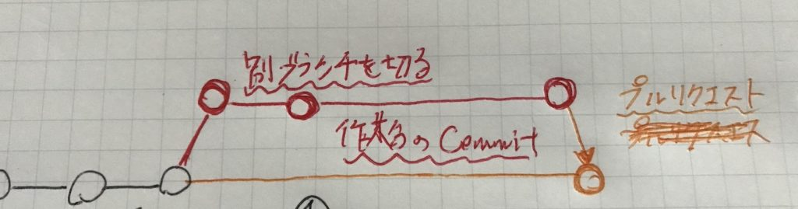

## はじめに

今回の記事は「実務で初めてgitを使う」を対象に

・gitとは何なのか  
・githubの運用方法  
・代表的なコンフリクトの解消方法

についてまとめたものです。実務に放り込まれてgit全然わからないよーーー！ってなっている人は参考にすると良いかも。。

## Gitってなに

一言で言うと「分散型バージョン管理システム」です。

むずかしいですね。順を追って説明していきます。

### バージョン管理とは

バージョン1,2,3…と古い歴史から最新の歴史まで追って変更を管理している仕組みです。

#### もしバージョン管理がないと

・レポートなどで古いファイルを残しながら、変更を加えたい

→\[最新版\]とかつけて新規で作り直す

・みんなで変更を同時にしたい

→Excelだと同時編集できなくて2人目とかは「読み取り専用になる」

#### バージョン管理システムがあるとどうなる

バージョン管理システムではファイルそのものを保存するのではなく、**誰がどんな変更を加えたかを管理している**ので、

・過去のバージョンにすぐ戻れる

・複数人の変更の必要なところだけを保存できる

→より複数人での作業に向いている仕組み！

### 分散型とは

分散管理システムの対義語にあたる中央管理システムとは何なのか？

中央管理システムは1つのサーバーで全体を管理しているものです。  
例：googleドライブ

デメリットとしてエンジニアによる同時に編集厳しい。  
サーバーが1つである為、それが壊れたらつんでしまう。

この中央管理システムのデメリットに対応する為に作られたのが、分散管理システムです。

分散管理システムは中央管理システムとは違い、本体だけでなく完璧な複製をユーザー各々の手元におけます。

それゆえに本体のサーバー壊れても死なない。  
複数人での共同開発がしやすい。

などチーム開発に向いている恩恵が得られます。

### Githubとは

gitとは上記で説明した「分散型バージョン管理システム」の仕組みそのもの。  
Githubはgitを便利に使えるwebサービス的な位置づけ。

Githubが独自に加えてくれてる機能が多々あるよ(プルリクエストとか)

## Githubの運用イメージ

実際の作業のイメージを図を使って説明していきます。

### ①自分の手元にgit cloneする

githubで行われてきた歴史(変更の過程)を自分の手元のパソコンに複製する。

```
git clone プロジェクト名
```

※○がコミットの歴史です


### ②別ブランチを切って作業(commit)を進める

git clone後は自分の手元で作業を進めて、commitして、Githubにpushしていくながれ。

いきなり本流ブランチ(developなど)に入れるのはリスクが高いので、プルリクエストを使って変更を加えていきます。

プルリクエストの準備として、一旦、Github上に自分の手元の変更を反映させたブランチを作ります。（別ブランチを切る）

```
git checkout -b ブランチ名
```

その後、作業を手元で進めてcommitしたら、そのブランチに反映させていきます。

```
git commit
```

※その他、git add ~、git push ~などの作業も別ブランチに反映させるには必要です。


### ③プルリクエストを送る

別ブランチを切って作業を進めていた分を、本流ブランチに反映させる行為がプルリクエストです。

プルリクエストのイメージとしては「別ブランチで書いていた分を本流のブランチに入れて欲しいなー」というお願い的な感じ。

それをレビュアーなどがapproveの判断をしたらマージされて、本流に反映されます。



この本流からブランチを切って、プルリクエストがマージされて本流にマージされるまでを繰り返すことで、開発が進んでいきます。

## コンフリクトについて

### 何故コンフリクトが起こるのか？

先ほど説明した手順で開発を行っていていきます。

下の画像の様に、オレンジのプルルクエストが先にマージされていたとします。

その後に赤がプルリクエストを送り、オレンジの変更分と同じファイルを変更していた場合、コンフリクトが起こります。

コンフリクトはGithubではオレンジの変更と赤の変更のどっちを最新版として取り入れて良いか判断できないから起きる現象です。


### コンフリクトの解消方法①

根元を変える方法。最新版から持ってきている事にすればコンフリクトは解消されます。

この方法ではオレンジの分の変更を、自分の変更で完全に上書きし、正しい歴史を積み重ていきます。


コマンド

```
git reset --hard HEAD
git clean -df　
//上記2つセットで作業用ブランチを一旦綺麗にする

git checkout develop
git pull
//本流ブランチに戻って最新版を手元に取ってくる

git checkout コンフリクト解消したいブランチ名
git rebase develop 
//ここで最新のdevelopに根元を変えている

~~手元でコンフリクト解消~~

git push -f origin コンフリクト解消したいブランチ名
//-fは--force。強制的な上書きをしている
```

### コンフリクトの解消方法②

新しくブランチを切って、最新版の本流と自分の使っていたブランチをマージして手元で綺麗にする方法。

コンフリクトを解決する為に、最新版から新しくブランチ（青）を切り直す。そこに今まで自分が作業していたブランチ(赤)の変更をマージする。

マージした時点で新しく切り直したブランチでは、オレンジでの変更分と、赤での変更分がバッティングしているので、それを綺麗にして正しい歴史として本流のブランチにマージする。


コマンド

```
git reset --hard HEAD
git clean -df
//上記2つセットで作業用ブランチを一旦綺麗にする

git checkout develop
git pull
//本流ブランチに戻って最新版を手元に取ってくる

git checkout -b 新しいブランチ名　
//新しいブランチを切る

git merge --squash コンフリクト解消したいブランチ名　
//さっきまでの変更分を一個のcommitにまとめて、新しく切ったブランチにマージする

~~手元でコンフリクト解消~~

git add *
git commit
git push
(新しいブランチが push されているので、そこからプルリクエストを改めて投げ直す)
```

## まとめ

チームでのgit運用になれないうちはpushする。プルリクエストを送る。などで「developブランチを壊してしまうかも、、」と恐怖を感じるかもしれません。

でも、gitは差分の積み重ねの歴史で出来ているので、ちょっと変な変更をマージしたぐらいで壊れる様な仕組みにはなっていませんし、直すことも可能です。

経験値のあるエンジニアがレビュアーで入ってくれている現場なら、安心してどんどんgitを使っていくことをおすすめします。

gitで作業している時の小ネタ。

https://qiita.com/terry\_6518/items/44ce2419a78d4121569a
