この記事は

- React hooksで初歩的な事は学んだので、中級的な扱い使い方をしたい
- 外部API取得のオーソドックスなやり方を知りたい
- Charts.jsやMaterial-UIなどの周辺機能の基礎的な使いたい

という人向けに、巷で良く見るCOVID-19のトラッカーアプリのチュートリアルで実際に学べた内容をまとめたものです。

参考になれば幸いです。

## 今回作ったCOVID-19-TRACKERアプリ

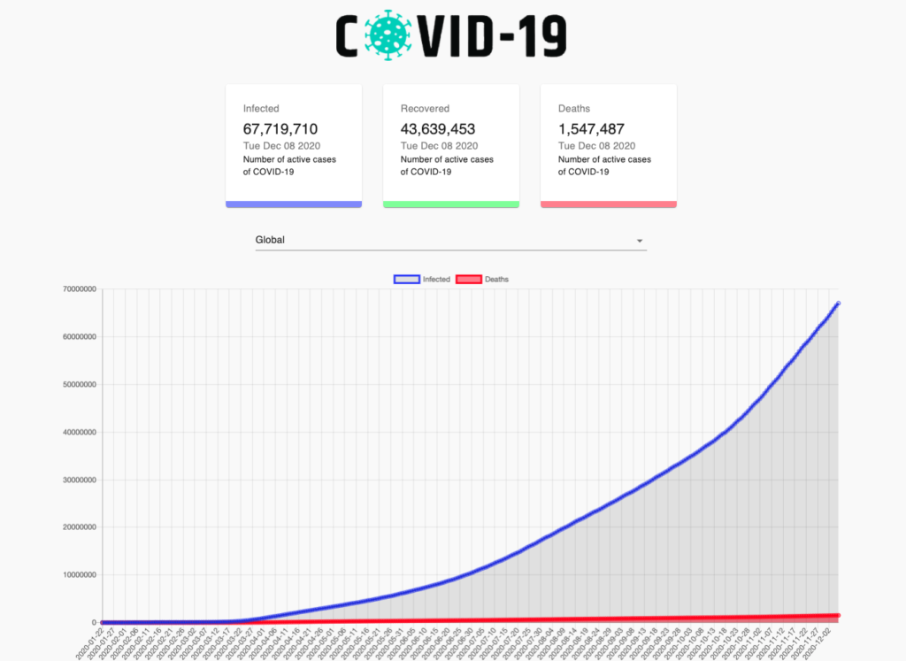

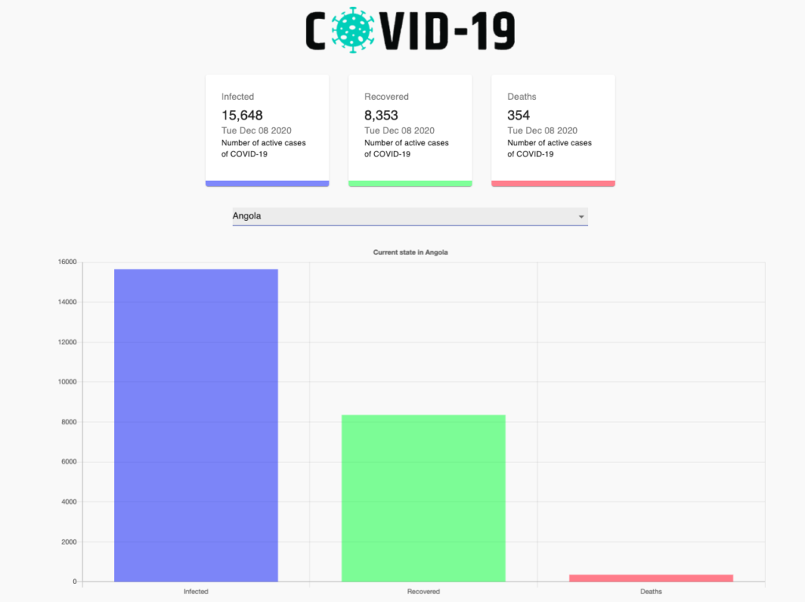

こちらで実際に触われます。

Netlify：[https://terry-covid19-tracker.netlify.app/](https://terry-covid19-tracker.netlify.app/)

取得したAPIをグラフとカードにて表示をするアプリケーションです。

React hooksで非同期処理を使い、プルダウンで国を選ぶ毎にAPIを叩いて、その国のデータをグラフに表示します。

React + TypeScript 、Charts.js、Material.jsを使いました。

コードはこちらにあるので、使いたい人はぜひ。

Github：[https://github.com/gunners6518/covid\_19\_tracker](https://github.com/gunners6518/covid_19_tracker)

### 学べた3つの事

- useEffectで外部APIを非同期処理する
- Charts.jsを使ってカードやグラフに表示する
- useCallbackを使いプルダウンの値が変わる毎にグラフを再描画する

## ディレクトリ構成

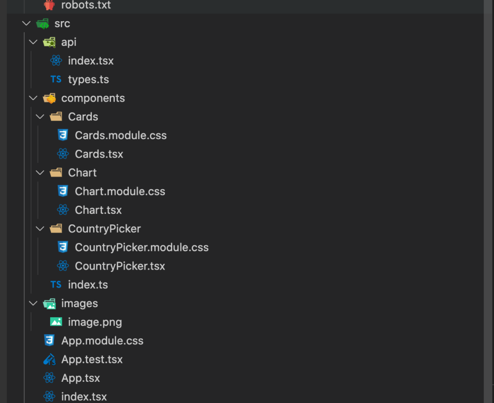

### api

index.tsx：全体データ、日次データ、国別データなど外部APIの取得をしています。

type.ts：取得したAPIデータの型定義をしています

### component

#### cardsフォルダ

cardsコンポーネント。Infected、Recovered、Deathsにカードを分けて総数、最終更新日を表示しています。

総数はcount-upにて表示しています。デザインはMaterial-UIを用いています。

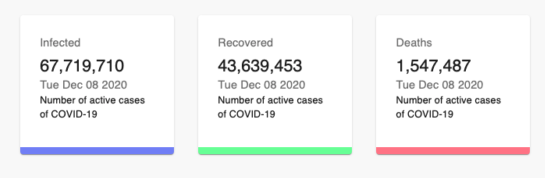

#### Chartフォルダ

chartコンポーネント。全体と国を選択している時とで、グラフの切り替えを行っています。  
全体の時はInfected、Deathsを総数を日付毎に追った折れ線グラフ。  
国別の時はInfected、Recovered、Deathsの総数を棒グラフにて表現しています。

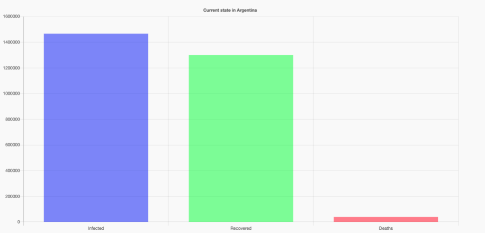

### CountryPicker

プルダウンのコンポーネント。APIから国一覧を取得し、プルダウンで選択できます。  
プルダウンの値が変わると、App.tsxにコールバックが走り、それによって各コンポーネントにpropsで送るデータが変わる事によってグラフとカードの値を切り替えています。

プルダウン

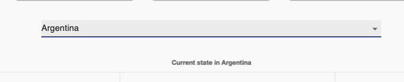

プルダウン選択時

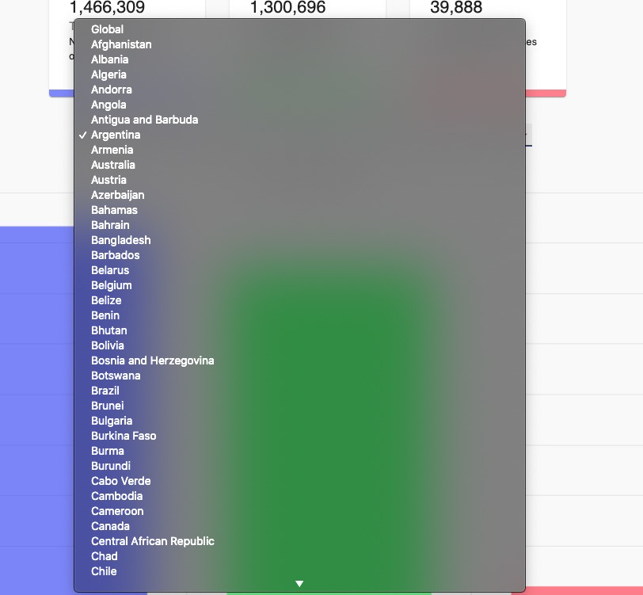

### App.tsx

componentフォルダにあるコンポーネントの親にあたるコンポーネントです。  
api/index.tsxで取得したapiデータをuseEffectにて非同期処理して各コンポーネントに渡しています。

## useEffectで外部APIを非同期処理する

### ①外部APIを取得する

apiを叩く関数fetchDataを作る。  
もし引数にcountryが入る(国が選択されている)時はその国のデータを取得。  
そうでない時は全体のデータを取得しています。

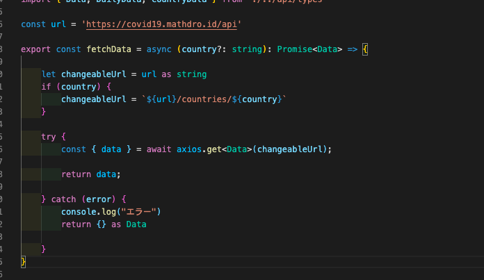

### ②useEffectで外部APIを非同期処理する

useEffect内でasyncを使い非同期処理を行い、クリーンアップ関数でunmountedを使いコンポーネントがマウントしている時だけ処理が行える様にしています。

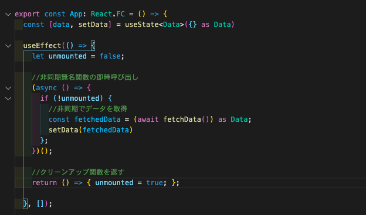

useEffectや非同期処理の詳しい解説はこの記事にて行っているので、参考にしてみて下さい。

https://terrblog.com/useeffect%e3%81%ae%e5%9f%ba%e6%9c%ac%e7%9a%84%e3%81%aa%e4%bd%bf%e3%81%84%e6%96%b9%e3%81%a8%e9%9d%9e%e5%90%8c%e6%9c%9f%e5%87%a6%e7%90%86%e3%81%ae%e3%82%84%e3%82%8a%e6%96%b9/

## データをCharts.jsを使ってカードやグラフに表示する

Charts.jsを用いる事で簡単にグラフが作れる様になります。

Github：[https://github.com/reactchartjs/react-chartjs-2](https://github.com/reactchartjs/react-chartjs-2)

### ①react-chartjs-2をインストール

```
npm install --save axios react-chartjs-2
```

### ②各々のコンポーネントにデータを入れる

Charts.jsには固定のプロパティがあり、それらに値を入れる事でグラフを作成できます。  
以下の画像は棒グラフの時のものです。

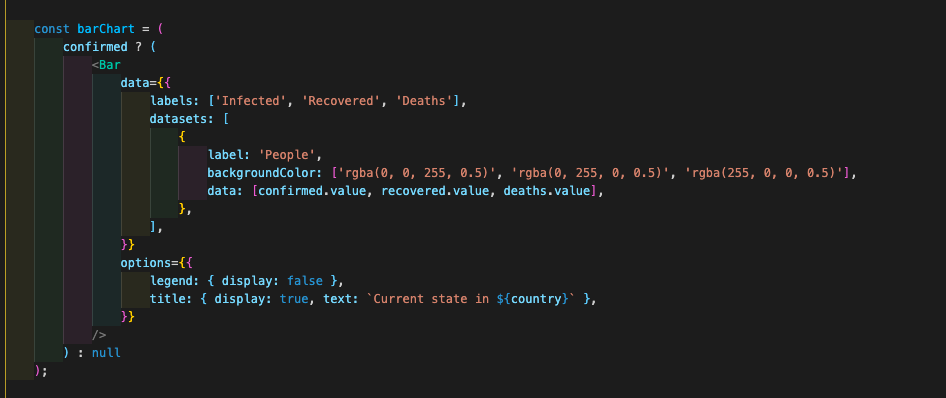

#### コンポーネント：グラフのタイプ

折れ線グラフではLine、棒グラフではBarを使いました。

labelsで横軸のラベル、datasetsでグラフに入れるデータを指定します。

## useCallbackを使いプルダウンの値が変わる毎にグラフを再描画する

### ①CountryPickerコンポーネントにプルダウンを作成し、値が変わる毎にコールバック関数を呼ぶ

FormControl、NativeSelectedはMaterial-UIのコンポーネント。

NativeSelectのoptionにはプルダウンで選べるメニューが入ります。

今回は外部APIから取得したデータをmapで回す事で国名一覧をプルダウンに表示させています。

また、onChangeイベントでプルダウンの値が変わる毎にApp.tsxのコールバック関数であるhandleCountryChange()を呼んでいます。

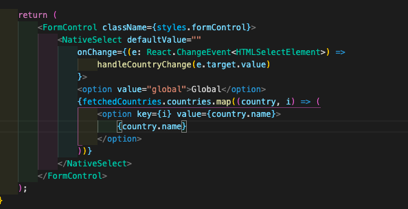

### ②App.tscにuseCallbackを設置し親コンポーネントのdataを変える

先ほどCountryPickerコンポーネントで呼ばれたコールバック関数をApp.tsx側では定義していきます。

CountryPickerコンポーネントにはプロパティでhandleCountryChangeを設定し、App.tsx内のonHandleCountryChangeが呼び出されるようにします。

onHandleCountryChangeではuseCallbackを使いメモ化によって実際にプルダウンの値が変わった時のみ処理を再実行します。

処理の中ではプルダウンで選ばれた値をselectedCountryとしてfetchDataに入れる事でsetDataを更新しています。  
setDataによってdataが変わるので、Card、Chartコンポーネントにプロパティで渡している値が変化する仕組みです。

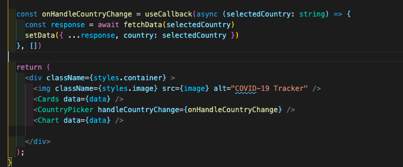

## その他の学び

TypeScriptの書き方でもまだまだ学ぶ事が多く、今回のアプリケーション作成でも散々コンパイル時のエラーに悩まされました。

その時々で学んだ事をメモ書き的にまとめておきます。

### undefinedの扱い方

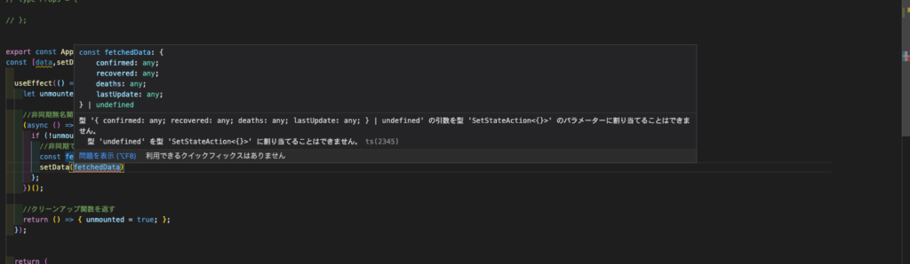

上記のコードはtry-catchにてエラー時のreturnがundefinedになってしまう事によるエラーでした。

条件分岐の時は、片方がundefinedにならない様に`as 型定義`　を添える必要があります。

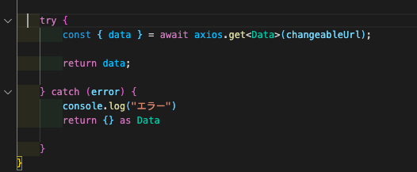

## まとめ

今回のアプリケーションは制作期間は10hほどでコード量的にも軽い方でした。

しかし内容的には基礎の網羅性があり、1つ1つていねいに理解する事で大きな収穫がありました。
