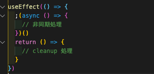

## はじめに

React hooksでは副作用の処理を目的としたuseEffectがあります。  
こんかいはuseEffectの基本的な使い方と関数コンポーネントで非同期処理を行う場合の例を説明していきます。

## useEffectとは

まずはuseEffectについてです。

useEffectの役割は「関数の実行タイミングをReactのレンダリング後まで遅らせる事」です。  
関数がレンダリングを行って画面に反映された後に実行されるので、DOMの書き換え、変数の代入、API通信などの副作用を扱うのに適しています。

以下が基本形です。

```
 useEffect(
        () => {
            実行関数
        },
        [ 依存配列 ]
    );
```

第一引数は実行関数で、第二引数が依存配列になります。

### 実行関数はレンダリングするたびに新しく作られる

実行関数はuseEffectが呼び出されるごとに新しく作られるので、画像の様にif文を使ったり、状況に応じて処理を変えることなども可能です


依存配列がない場合は、常に。依存配列が\[\]だと最初に一回。依存配列が指定されている場合は、それらに変更があった時に再実行されます。

### 依存配列でstateやpropsを使うのは注意が必要

特に依存配列を扱う際は注意が必要で、propsやstateに依存する関数入れない方が良いです。

propsやstateに依存する関数をいれていると、propsやstateが何に依存しているのかuseEffect部分だけ分からず、混乱を招くからです。

詳しくはこちらの記事などを参考にしてください。

https://qiita.com/keiya01/items/fc5c725fed1ec53c24c5

## useEffectで非同期処理を行う

さてuseEffectの特徴がわかった所で非同期処理についてみていきます。

画像の様にcovid-19のapiデータを外部から取得して表示する処理を行います。  
所得できるまでの時間はLoading画面を出します。


まずコールバックの中にasync関数やPromiseはいれられません。  
useEffectの戻り値はundifinedかクリーンアップ関数でなくていけないからです。

以下の形で書きます。



実際のコードだと以下の様になります。  
feactData()で実際にapiデータを取得し、setDataでuseStateを更新しています。


非同期処理のタイミングによってはコンポーネント削除後に実行されたりします。

unmountedでその対策をしています。

これにより、useEffect内で非同期処理ができます。

## 参考

https://hfuji.hatenablog.jp/entry/2019/02/24/173607

https://qiita.com/daishi/items/4423878a1cd7a0ab69eb

https://gist.github.com/tagty/fbcae0998ad439017fd1ebd119393019
