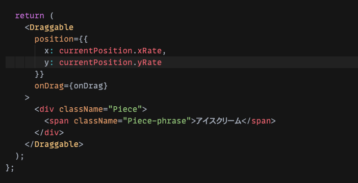
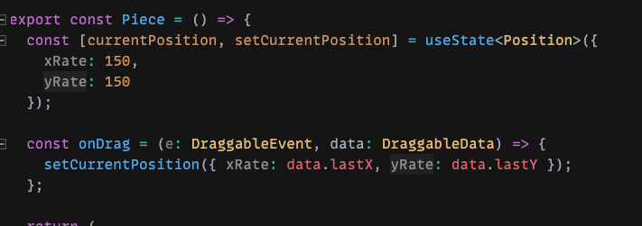
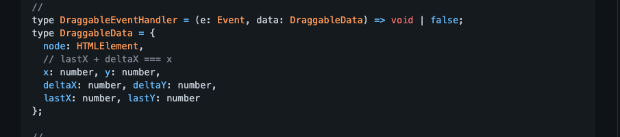
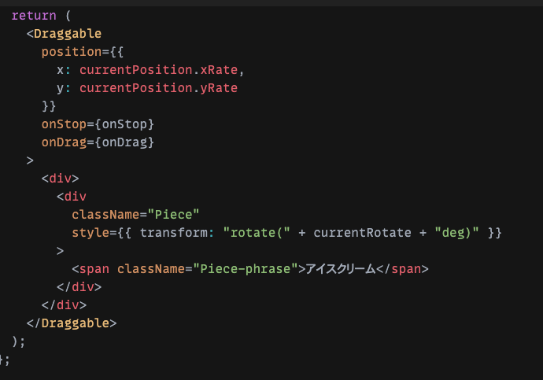
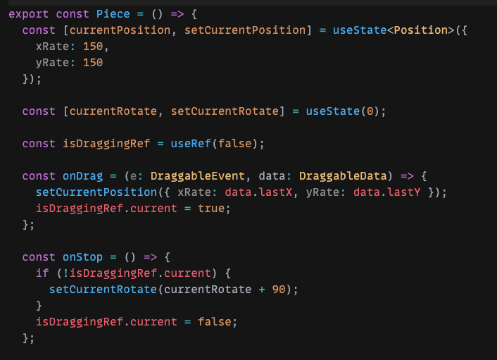

## はじめに

最近、Reactでパズルを作る機会がありました。  
そこでreact-draggableでドラッグにてピースを移動し、クリックにてピースを回転させる実装をしました。

  
この記事では、そこ過程で得たreact-draggbleでクリックイベントを追加する方法についてまとめています。  
react-draggableの情報は少なく、自分は苦労したので、少しでも参考になれば幸いです。

## react-draggableとは

github：https://github.com/STRML/react-draggable  
[デモ](http://strml.github.io/react-draggable/example/)

Reactでドラッグ処理を実現する為のライブラリです。  

## まずはドラッグを実現する

サンプルコード：[https://codesandbox.io/s/red-platform-3q7iv?file=/src/components/piece.tsx](https://codesandbox.io/s/red-platform-3q7iv?file=/src/components/piece.tsx)

まずはreact-draggbleを素直に使ってドラッグを実現しました。  
ポイントをいくつか解説していきます。

### ドラッグしたい要素を<Draggable>でラップする

> `<Draggable>`要素は既存の要素をラップし、新しいイベントハンドラとスタイルでそれを拡張します。DOMにラッパー要素は作成されません。

とドキュメントにあるので、まずは<Draggable>で要素をラップします。  
Propsにはx、yの座標とonDragイベントを渡しています。

### ドラッグイベントでstateを更新して、要素の座標を変える

useStateで座標の状態を定義します。  
onDragイベントで<Draggable>のdataから得た座標情報をstateを更新しています。

これにより、ドラッグ事に要素の座標変更が反映されます。

#### <Draggable>の型とProps

<Draggable>のPropsはドキュメントではこの様になっています。（[https://github.com/STRML/react-draggable#draggable-props](https://github.com/STRML/react-draggable#draggable-props)）

今回使った箇所はこの辺りです。

onDragイベントの型がDraggbleEventHandlerです。引数で取っているdataの方で在表の更新に使ったlastXとlastYが定義されています。

## ドラッグ+クリックを実現する

こっから本題です。

先ほど作ったドラッグ要素にクリックで回転する挙動を加えていきます。

サンプルコード：[https://codesandbox.io/s/react-draggble-onclick-jmwz8?file=/src/components/piece.tsx](https://codesandbox.io/s/react-draggble-onclick-jmwz8?file=/src/components/piece.tsx)

### DOM部分

ドラッグのみの時からの主な変更点は3つ。  
・onStopイベント追加  
・クリック要素にstyleを加え動的に回転を加えられる様にした  
・クリック要素を
でラップ

1つずつ説明していきます。

#### onStopイベントの追加

ここでなぜonClickイベントではなく、onStopイベントを用いています。

onClickイベントだとドラッグ終了時にも発火してしまいます。それを防ぐためにonClickに状態を持たせることも可能ですが、今回はonStopイベント実行時にて条件分岐を加えることにしました。  
これに関しては後述します。

またonStopにてクリック時のアクションを実装する事で、スマホなどのタッチ操作でもクリックと同じアクションを実装できます。  
onClickを使った場合、スマホ用にonTouchStartも用いる必要がありそうです。

参考：[https://github.com/STRML/react-draggable/issues/49](https://github.com/STRML/react-draggable/issues/49)

#### クリック要素にstyleを加え動的に回転を加えられる様にした

クリックした要素に実際に回転が見た目で加わる様に、style={}で動的にデータを流し込んでいます。  
currentRotateにはuseStateにより更新された回転の状態が格納されます。

#### クリック要素を
でラップ

こちらに関しては今回の実装の肝になります！！

先ほど述べた通り、クリックによる回転の実装はcurrentRotateが更新し、それをstyleの当て込んで実現します。  
しかし、<Draggable>では直下の子要素のstyleのtransformを制御してx,y座標を渡してドラッグ機能を実現しています。

<Draggable>直下でのtransformの操作はできないので、クリックイベントでstyleを反映させたい要素を
でラップする事でtransformを反映させています。

### イベント処理部分

主な変更点は以下の通りです  
・onStopイベントの追加  
・useRefの追加

#### onStopイベントの追加

onStopイベントではクリックした時の挙動を加えていきます。  
まず前提定としてonStopはクリック時も、ドラッグ終了時も両方発火してしまうので、　useRefにて条件分岐を行う事でクリック時にのみ処理をあてます。

条件分岐内ではcurrentRotate+90をする事90度の回転を加えています。

#### useRefの追加

useRefにてドラッグか否かを判定しそれをもとにonStopでの条件分岐を行っています。  
onStop時に参照したいだけなので、再描画等は入らない為useRefを使っています。

参考①：[USEREFの使い方がわからん](https://gitpress.io/@fukke0906/2020-03-04)

参考②：[React.useRef()を使って無駄なレンダリングを減らそう](https://qiita.com/tell-y/items/1c035292a23773a2ed0a)

上記の手順でreact-draggableでもクリックの処理を実現できます。
