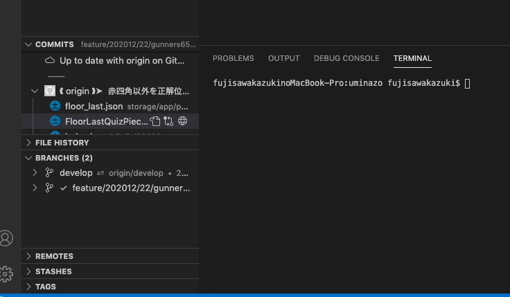

## はじめに

MacbookProを修理に出しました。  
戻ってきて、1から設定を行わないといけなかったので、振り返りとしてやった事をまとめました。

## まずは初期設定

https://qiita.com/ucan-lab/items/c1a12c20c878d6fb1e21

Macのシステム環境はこのタイミングで設定すると良いです。

CUI、GUI系は後ほど、やった分だけまとめます。

## 作業環境構築

CUIやらなんやらでコードを書く前に最低限必要なものです。

今回はフロント周り+ Laravelを使う感じで進めています。

### git

最初に入れないとコマンドラインで苦労します。

### HomeBrew

諸々インストールするために使います。

### ssh接続

https://qiita.com/shizuma/items/2b2f873a0034839e47ce

### npm

https://qiita.com/engineerhikaru/items/be4767d09681213ab833

### composer

https://qiita.com/sano1202/items/50e5a05227d739302761

フロントエンドとはいえ、バックがLaravelで書かれている場合はcomposerを先にinstallして多くと良いでしょう

### php

https://qiita.com/miriwo/items/cd54077aad7e139cf518

これでupdate

https://qiita.com/kuroro\_ru/items/046cba8e23d32599ee4a

## デスクトップアプリ

### slack

普段使っていれば。

### teams

マイクロソフトのコミュニケーションツールですね。プロジェクトで使っていれば

### discord

普段使っていれば

### zoom

web会議用。普段使わなくても急に入った面談がzoomで！なんて頃はザラなので、先に入れておくと良いです。

### notion

メモアプリみたいな感じ。今年僕はevernoteから移行しました。

### その他のおすすめツール

それ以外はここを参考に好き好きで。

僕はclipy、postman、gyoza、Biscuitあたりはよく使ってます。

https://qiita.com/amita/items/a103210bdab8bfb6a889

## vscode

IDEはvscodeを使ってます。

### 拡張機能

#### ・vscode-icons

フォルダがアイコンになって見やすくなります。

#### ・GitLens

こんな感じになって管理しやすいです。

使い方参考：[https://qiita.com/Mount/items/afe0c414edb5bf3473b5](https://qiita.com/Mount/items/afe0c414edb5bf3473b5)

#### ・Prettier

コードフォーマッターです。設定に関してはいろんな記事で言及があるので、好き好きで。

#### ・Bracket Pair Colorizer

かっこに色がついて見やすくなります。

#### ・Git History

コミット単位での振り返りがしやすくなります。

## まとめ

Macの設定をする過程で前はとりあえずインストールしていた物が、どういう使われ方をしているのか。本当に必要だったかを振り返れてすごく良かったです。  
エンジニアとして成長してる感を感じた瞬間でした。
